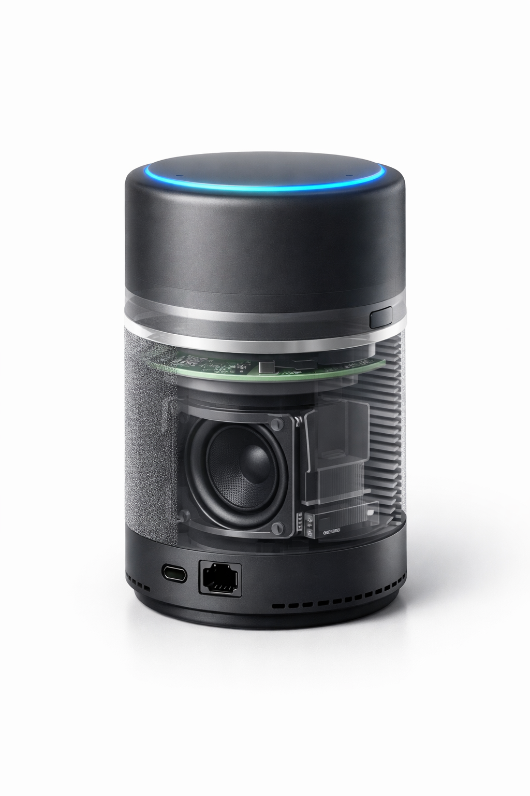
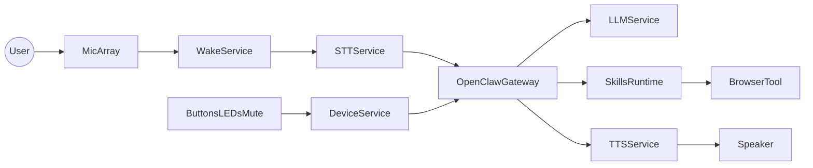
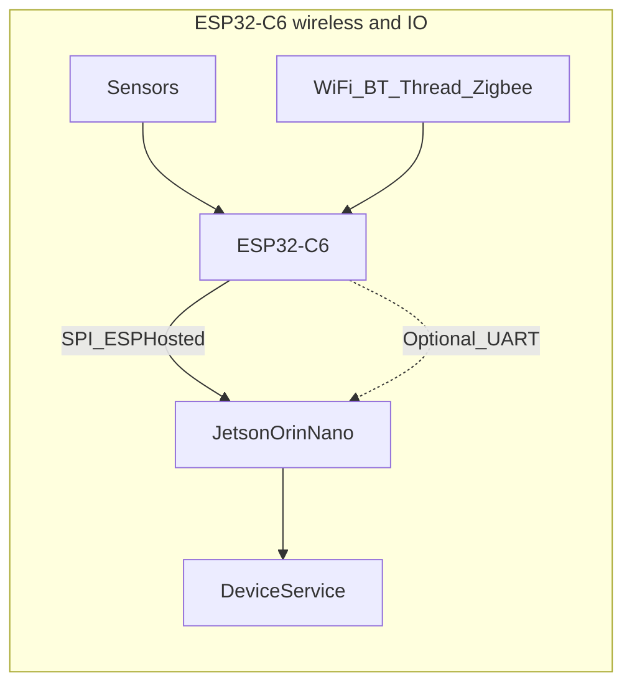
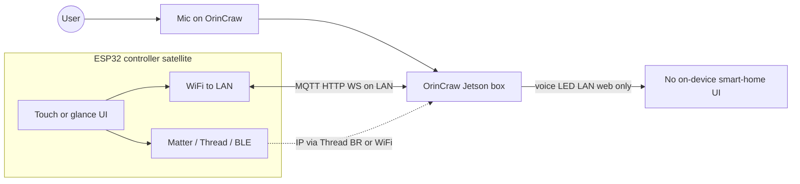

# OrinCraw — Hardware→Inference→UX Capstone (OpenClaw-based)

**OrinCraw** is the **project and product name** for this Phase 4 capstone: an always-on **local AI assistant box** built on **Jetson Orin Nano 8GB**, orchestrated by [**OpenClaw**](https://github.com/openclaw/openclaw), with **ClawBox-inspired** goals (offline-first voice, smart home, optional BYOK cloud). The roadmap folder is still named `5. OpenClaw Assistant Box` for repository structure; use **OrinCraw** in hostname, UI, OTA channel, and documentation.

Build OrinCraw end-to-end, optimized across:
- **Hardware-level**: power, thermals, storage, audio I/O, connectivity, serviceability
- **System-level**: secure boot, reliable OTA, observability, deterministic latency
- **Inference-level**: quantization, TensorRT/ONNX Runtime, batching, KV-cache, streaming, memory reuse
- **UX-level**: fast wake, low-latency voice, offline-first privacy, “it just works” setup

The target is **better usability than Alexa Pro-style assistants** by being:
- Offline-first (privacy by default)
- Faster perceived response (streaming + local)
- More reliable (no cloud dependency, robust OTA + rollback)
- More capable for power users (local skills/plugins, scripting, device control)

---

## 1) Product identity and naming

| Use | Example |
|-----|---------|
| **Product / project name** | **OrinCraw** |
| **Hostname** | `orincraw` or `orincraw-<room>` |
| **Local URL (mDNS)** | `http://orincraw.local` (or serial-suffixed variant for multiple units) |
| **OTA / update channel id** | e.g. `orincraw-stable`, `orincraw-beta` |
| **Stack orchestration (template)** | See [orincraw-deploy/docker-compose.yml](orincraw-deploy/docker-compose.yml) |

**Brainstorm names not chosen:** ClawForge, OrinOwl, EdgeManta, LocalLynx, WhisperHarbor, SentinelNest, NimbleDLA, HushPilot, QuartzClaw, KestrelBox.

### Product visualization (AI image prompts)

*Reference render / concept art only—not mechanical drawings or a frozen BOM.*

#### Exploded / cutaway (illustrative)

*Storytelling visualization only—not an approved assembly, stack-up, or thermal model.*

#### Retail packaging concept

*Packaging mock-up for marketing; final graphics and regulatory markings TBD.*

#### CMF study (color, material, finish)

*CMF exploration; satellite / accessory units are optional product ideas, not committed SKUs.*

#### Lifestyle context

*Lifestyle render for scale and ambience; proportions are approximate.*

Use these for pitch decks, README hero art, or CMF exploration. **Do not treat renders as engineering truth**—they are mood and proportion references only.

An **optional “glanceable display” SKU** (small round LCD or e-paper on top—time, climate, battery) is a **product decision**, not the default hero story; pros/cons and UX policy are in **§6**. If you generate that variant, relax **no screen** in the prompt for that shot only and still avoid **chat text** or readable private content in-frame.

The **optional ESP32 smart-home controller** (wall/shelf satellite, Matter-prefer) is a **separate product render**—see **§3**; use the **Optional master prompt — smart-home controller (satellite)** below so it is not confused with the voice-assistant cylinder.

**Master prompt (copy-paste):**

> Premium smart-home AI assistant hardware, compact voice-first device, **no screen**. Cylindrical or softly rounded tower (~130 mm tall), matte dark graphite polycarbonate with a thin brushed aluminum accent ring. **Top:** minimal LED status ring, soft blue pulse (listening). **Front:** acoustic fabric grille, full-range speaker, small recessed **hardware mute** on the side. **Base:** subtle ventilation slots, rubber foot ring. **Rear:** USB-C PD, Gigabit Ethernet, clean industrial design. Photorealistic product photo, studio softbox, white seamless background, soft shadow, three-quarter hero angle, 85 mm lens look, shallow DOF, high detail, **no text, no logos, no people**.

**Negative prompt (when the tool supports it):** screen, display, laptop, phone, messy cables, cartoon, illustration, low quality, blurry, deformed, garish RGB gamer aesthetic, watermark, readable text, brand logos.

**Optional master prompt — glanceable top UI (display SKU, copy-paste):**

> Same OrinCraw-class smart-home AI assistant as above—cylindrical tower (~130 mm), matte dark graphite, brushed aluminum accent ring, acoustic fabric grille, hardware mute, USB-C PD and Ethernet on base. **Top surface:** keep the **soft blue LED status ring**; **add a small round flush-mounted panel** (~35–45 mm) centered inside or beside the ring—a **high-contrast monochrome or e-paper–like** glanceable UI showing only **abstract icons and digits**: **clock time** (generic numerals, not a real timezone), **simple battery glyph + “100”** style segment, **tiny sun/cloud** weather icon (no words), **indoor temperature as two digits + degree symbol**. **No sentences, no chat bubbles, no notifications, no app chrome, no brand names.** Soft anti-glare cover, subtle bezel; still photorealistic studio product shot, white seamless, three-quarter hero, 85 mm look, shallow DOF, **no logos, no people**.

**Negative prompt (UI variant — use instead of the default negative for this shot):** laptop, phone, tablet, large screen, TV, messy cables, cartoon, illustration, low quality, blurry, deformed, garish RGB gamer aesthetic, watermark, **readable words or sentences**, **chat UI**, **message threads**, **notification text**, brand logos, **app store icons**, **QR codes**.

**Optional master prompt — smart-home controller (satellite, ESP32-class, copy-paste):**

> **Separate** compact smart-home **control panel** (not a voice speaker). **Form:** shallow **wall-mount or magnetic shelf** puck or rounded rectangle, ~95–115 mm wide, ~12–18 mm deep, matte **warm gray or graphite** polycarbonate, **soft micro-texture**. **Front:** **small touch-capable glass panel** (~60–75 mm) showing a **neutral smart-home dashboard**—**icon-only tiles** (generic lamp, thermostat arc, lock, blinds, scene “star” **without labels**), **soft pastel tile backgrounds**, **no sentences**, **no chat**, **no notifications**, **no WiFi password fields**, **no personal names**. One **tiny status LED** (amber/white) beside the glass; optional **very subtle** abstract **mesh / hex** motif in the bezel suggesting **Thread / Matter** (decorative only, not a logo). **Bottom edge:** **USB-C** for power only. **No microphone**, **no speaker grille**, **no large cylinder**. Photorealistic **studio product** photo, white seamless, soft shadow, three-quarter or straight-on, 85 mm lens look, shallow DOF, **no logos, no people**.

**Negative prompt (satellite controller — use for this shot):** voice assistant, **smart speaker**, **cylindrical tower**, **fabric acoustic grille**, **microphone holes**, laptop, TV, cartoon, illustration, low quality, blurry, deformed, gamer RGB, watermark, **readable words**, **real app screenshots**, **notification banners**, **QR codes**, brand logos, **OrinCraw voice device** as the main subject (unless intentional **lifestyle** variant below), messy cables.

**Tool hints**
- **Midjourney:** `--ar 4:5` or `--ar 16:9` for hero; add `--style raw` for straighter product look; iterate with `--sref` on a seed you like.
- **DALL·E / ChatGPT image:** ask for “studio product photography, single object, white background” and paste the master paragraph.
- **Flux / SDXL:** use the master prompt + negative; CFG medium; fix seed for A/B on grille texture and LED diffusion.

**Shot variants (short add-ons)**
- **Lifestyle:** same device on walnut side table, warm evening light, living room bokeh, still no screen.
- **CMF study:** three colorways in one frame (graphite, warm gray fabric, silver accent)—orthographic front/side/top layout sheet.
- **Packaging:** minimal black retail box beside device, embossed line only (no readable words).
- **Exploded (stylized):** ghost layers suggesting speaker, PCB edge, heatsink fins—keep subtle, not a full mechanical drawing.
- **Optional display SKU:** use **Optional master prompt — glanceable top UI** + **Negative prompt (UI variant)**; top-down or three-quarter to show the round panel clearly.
- **Optional smart-home controller (satellite):** **Optional master prompt — smart-home controller (satellite)** + **Negative prompt (satellite controller)**; straight-on or slight angle to read tile layout; **lifestyle:** same panel mounted near a light switch with **blurred** cylindrical assistant **far** in background (optional, keep assistant non-primary).

---

## 2) Product definition (what “better” means)

### User promises (non-negotiables)
- **Always ready**: wake word works within seconds of power-on; no “boot lag” surprises.
- **Instant feedback**: audible/visual acknowledgement within ~150–250ms of wake.
- **Offline-first**: core voice + local chat + local automations work without internet.
- **Private by default**: no audio leaves the device unless user explicitly enables a cloud connector.
- **Predictable**: stable latency (p99) under load; graceful degradation when hot or memory-tight.

### Primary use-cases
- Voice assistant (wake word, STT, NLU, TTS, tools)
- Browser automation (“Open this site, login, click X”)
- Home control (MQTT/Home Assistant)
- Local RAG over personal docs (optional)

### Offline-first product requirements & acceptance criteria
OrinCraw ships **offline-first**: core voice and automation work **without internet** unless the user enables optional cloud connectors.

**Must work with WAN unavailable** (no upstream internet; LAN may still exist):
- Wake word → LED/audio ack → streaming STT → **local** LLM + tools → streaming TTS
- Web UI reachable on the LAN for status, smart-home control, and settings (after initial onboarding)
- Local skills: MQTT/Home Assistant, browser automation to **LAN** targets, RAG over **on-device** `/data` storage
- OTA: if no route to update server, show explicit **“update unavailable”** (LED + UI); no silent failure

**Privacy (default)**
- No microphone audio and no transcribed text leave the device unless a **cloud connector** is explicitly enabled
- No vendor cloud logging by default; any future diagnostics upload must be **opt-in** and documented

**When optional BYOK cloud is enabled** (see §4)
- UI indicates **local vs cloud** for the active policy or last reply where practical
- If the cloud API is unreachable, **fall back** to local model or a clear spoken/UI error—no indefinite hang

**Acceptance checklist (QA)**
- [ ] Soak ≥24 h with WAN down: no unbounded memory growth / OOM in the voice pipeline
- [ ] WAN drops mid-session: recover within one user turn (retry or explicit prompt)
- [ ] Factory reset: returns to **offline-first** defaults; cloud keys and connectors **wiped**

---

## 3) Hardware platform (recommended + alternatives)

### Dedicated hardware options for OrinCraw (OpenClaw stack)

Dedicated hardware options for **OpenClaw** prioritize **isolation**, **efficiency**, and **24/7 operation** so the always-on assistant is not tied to a laptop (thermal throttling, sleep policies, accidental suspend, and a larger attack surface).

#### Top options compared

| Device | AI power (approx.) | RAM / storage | Power | Price (indicative) | Setup | Strengths |
|--------|-------------------|---------------|-------|-------------------|-------|-----------|
| **ClawBox One** | ~67 TOPS | 8GB / 512GB NVMe | 15–20 W | €549 | ~5 min | Preloaded, silent, plug-and-play |
| **Mac Mini M4** | ~38 TOPS | 16GB+ / 256GB+ | ~65 W | €700+ | 1–2 h | Fast inference, multi-use |
| **ACEMAGIC M5 PRO+** | ~126 TOPS | 128GB / 2TB | 50–100 W | $800–1200 | 1–2 h | Heavy models, scalable |
| **Jetson Orin Nano (DIY)** | ~67 TOPS | 8GB / expandable | 7–15 W | $450+ | 2–5 h | Low-cost, customizable |

*TOPS and on-device figures are workload- and stack-dependent; use the table for **relative** shopping only.*

*OrinCraw targets **512GB NVMe** on Jetson (Orin Nano class does **not** rely on soldered eMMC for system storage in this program); **stolen-drive** risk is **high**—**§8** *Physical theft & storage* is **mandatory** for production (FDE, keys off-drive, mechanical hardening).*

#### Compared with **OrinCraw** (this capstone)

**OrinCraw** here means the **product spec in this guide**: **Jetson Orin Nano 8GB-class** compute (dev kit for bring-up → **custom carrier** for ship), **512GB NVMe** (M.2 **2280**, boot + rootfs + models + logs + OTA staging) as **default** mass storage, **Gigabit Ethernet**, **ESP32-C6** + **ESP-Hosted** on **SPI** for Linux WiFi/BT and smart-home radios, **I2S** mic array + speaker, **USB-C PD** power path, optional **battery**, **offline-first OpenClaw** orchestration with OTA discipline, and **strong at-rest security** when hardware is stolen (**§8**)—not a single off-the-shelf retail bundle.

| Dedicated option | How it relates to OrinCraw |
|------------------|----------------------------|
| **ClawBox One** | **Closest turnkey cousin**: same **Jetson Orin Nano–class** story and OpenClaw-friendly stack. OrinCraw **diverges** on **mechanical/CAD**, **custom carrier BOM** (only what the UX needs), **ESP32-C6 + Matter/Thread/Zigbee** integration, and **your** OTA/channel naming—more engineering, **no** boxed retail SKU unless you ship one. |
| **Mac Mini M4** | **Different platform**: Apple Silicon + macOS vs **ARM SoC + L4T/JetPack** pipeline. Often **faster** for large local models and dev tools; **higher** sustained wall power and **no** native match to OrinCraw’s **ESP-Hosted / ESP32-C6** RF + IoT architecture. Use as a **dev or secondary** machine, not a drop-in for the Jetson carrier spec. |
| **ACEMAGIC M5 PRO+** (x86 + dGPU class) | **Heavy throughput / RAM** for big models and multi-agent loads. **Much higher** TDP, **different** stack (CUDA on dGPU vs Jetson unified memory + TensorRT-on-Orin workflows). OrinCraw optimizes **watts-per-wake-word** and **edge BOM**; this class optimizes **raw FLOPS and DRAM**. |
| **Jetson Orin Nano (DIY)** | **Same silicon family** as OrinCraw **Phase 1** (dev kit or equivalent). DIY stops at “board in a case”; OrinCraw continues to **custom PCB**, **product audio**, **C6**, **enclosure thermals**, and **acceptance criteria** in §2–§3. **Lowest cost** entry to validate software; **not** the shippable product by itself. |

**One-line takeaway:** If you want **“buy and run OpenClaw today”**, **ClawBox** aligns with the stack. If you want **“own the hardware product”** (carrier, RF, audio, OTA), that **is** OrinCraw; **DIY Jetson** is the on-ramp; **Mac / ACEMAGIC** are **adjacent** hosts for speed or scale, not the same architecture.

#### Performance and use analysis

**ClawBox** fits OpenClaw’s core pattern well—on the order of **~15 tok/s** on 8B-class models, low-friction messaging and browser automation, and **offline-capable** privacy at negligible power cost (~€1/mo at typical EU residential rates). It is purpose-built (pre-installed stack on **Jetson Orin Nano Super**), beating Mac Mini on **efficiency** and **always-on suitability** despite lower headline speed for some workloads. **Mac Mini** shines for **30B+** local models and general dev workflows but runs fans and uses roughly **4×** the electricity for comparable 24/7 duty. High-end mini PCs (**ACEMAGIC**-class) suit **enterprise / multi-agent** loads; **DIY Jetson** matches tinkerers who want full control—consistent with the dev-kit → custom carrier path below.

#### Cost and security verdict

**ClawBox** offers strong **TCO** for a turnkey box (€549 one-time often beats ~2 years of cloud subs for comparable capability) with **maximal isolation** by default—no vendor telemetry on the assistant path, **offline-first** operation when configured that way. Use **Mac** when raw speed and macOS tooling matter; **pair both** (dedicated assistant + dev machine) is a common split. All of these beat a **VPS** for **mic/audio privacy**; add a **UPS** on the LAN path for reliability. For Jetson software lineage and upgrades on DIY or carrier builds, see **JetPack / L4T version strategy** in this section.

### Product requirement: custom PCB for ultimate product-grade
The **ultimate shippable product** is **not** a stock dev kit in a box. It requires a **custom PCB** (carrier / product board) that is **purpose-built** for this assistant:

- **Why custom PCB**: Dev kits include **unnecessary** parts (extra connectors, debug headers, full-size carriers, features you do not ship) and **miss** product needs (tight integration of PD, audio codec, ESP32-C6 + antenna, LED ring drivers, battery BMS, mechanical fit, EMI/thermal). A custom board **removes waste**, **adds only what the BOM requires**, and reaches **product-grade** reliability, cost, and certification readiness.
- **BOM discipline**: For each net and component, ask: **required for the defined UX?** If not, **omit**. If yes but missing on dev kit, **add** (e.g. dedicated SPI for ESP-Hosted, PMIC for battery path, codec for I2S mics, status LED chain, factory test points).
- **Compute**: Use a **Jetson compute module** (e.g. Orin Nano 8GB module) on **your** carrier—not the dev kit PCB—for the final product. Software is developed and proven on the dev kit first, then **ported** to the custom carrier (**document the JetPack revision** per release; re-validate pinmux, power, and drivers after each JetPack migration).
- **Deliverables**: Schematics, PCB layout, stackup, fab/assembly outputs (Gerber, pick-and-place, BOM), DFM/DFA notes, and **bring-up** checklist for the custom board (see §10 Hardware deliverables).

### Recommended baseline (bring-up and software development)
Use the **Orin Nano 8GB Developer Kit** only as the **reference for software bring-up** and pipeline development; migrate to the **custom module carrier** for the ultimate product.

- **Compute (bring-up)**: NVIDIA Jetson Orin Nano 8GB Dev Kit — **JetPack / L4T strategy** (pinned versions, upgrades): see **JetPack / L4T version strategy** below.
- **Storage**: **512GB NVMe** (**default**; M.2 **2280** on carrier—boot + rootfs + models + logs/OTA staging). **Jetson Orin Nano** bring-up and ship product use **NVMe**, not eMMC, for this capstone. **Theft:** treat **removable NVMe** as **routine** attack—**full-disk or full-root+`/data` encryption** + **key custody off the naked drive** are **production requirements** (**§8**); add **mechanical** hardening (shield, security screws, tamper labels) and optional **TCG Opal SED** if qualified.
- **Connectivity**: **Gigabit Ethernet** on Jetson only (no on-board WiFi 6 / BT 5.x). **WiFi and Bluetooth/BLE** to Linux use **[ESP-Hosted](https://github.com/espressif/esp-hosted)** over **SPI** between Jetson and **ESP32-C6** (see below). **Thread**, **Zigbee**, and **Matter** remain on the C6 (coexistence with ESP-Hosted firmware per Espressif docs). **Reliable WiFi** is a product requirement—SPI + ESP-Hosted-NG gives a proper Linux wireless interface (`cfg80211`, `wpa_supplicant`, NetworkManager).
- **Audio**: 2-mic array + far-field DSP (I2S) + speaker (see “Speaker design” below)
- **Power**: USB-C PD input (target 15W typical, 25W peak); **own battery** option for backup/portable (see “Battery design” below)
- **Enclosure**: thermally designed case with dedicated heat sink and airflow (see “Heat sink design” below)

### JetPack / L4T version strategy
OrinCraw tracks NVIDIA releases in **phases** so early bring-up can start on a stable older stack and the product line moves forward deliberately.

| Phase | JetPack target | Role |
|-------|----------------|------|
| **1 — Initial bring-up** | **5.1.2** | First flash, kernel, and baseline validation (audio, **NVMe** rootfs **512GB** default, Ethernet, early inference experiments). Pin **CUDA / cuDNN / TensorRT** to NVIDIA’s matrix for **5.1.2**. |
| **2 — Production-aligned** | **6.2.1** | Planned upgrade for the main software line: rebuild **TensorRT/ONNX** engines on-device, rebuild **ESP-Hosted** host driver for the new **L4T kernel**, rebase **containers** to matching L4T base images, re-run OTA + rollback tests. |
| **3 — Future** | **7.x** | Adopt **when NVIDIA officially supports** the OrinCraw **target module + carrier** on JetPack 7. Treat as a **major migration** (same rigor as 5 → 6: full regression, optional forced OTA channel). |

**Rules**
- Record the **active JetPack** in release notes, factory config, and `/health` (or equivalent).
- Never load kernel modules or DKMS builds (e.g. ESP-Hosted) built for one JetPack onto another without rebuilding.
- After each jump, re-run the **benchmark checklist** (§10) and **risk review** (§9), especially **R2** (ESP-Hosted / kernel).

### Hardware phases (dev kit → custom PCB)
- **Phase 1 — Software on dev kit**: Validate STT/LLM/TTS, OpenClaw, ESP-Hosted (SPI to C6 on a **breakout or interposer** if needed), audio pipeline, and OTA on the **Orin Nano Dev Kit**.
- **Phase 2 — Ultimate product (required)**: **Custom carrier PCB** for **Jetson Orin Nano (or Orin NX) compute module** with only necessary circuits: module socket, **USB-C PD** controller and power path, **Ethernet PHY**, **M.2 NVMe** socket / holder (**512GB** default SKU), **I2S audio codec** + mic array interface + speaker amp, **ESP32-C6** (SPI for ESP-Hosted + optional UART for LED/buttons), **LED drivers** (ring or chain), **buttons/mute**, optional **battery + BMS**, **test points**, **ESD/EMI** per certification plan. **Remove** dev-kit-only blocks (unused USB stacks, debug, duplicate power) from the product BOM.
- **Optional SKU**: Second PCB revision or BOM variant for **Orin NX 16GB** if you need more unified memory for a larger local model—same mechanical envelope where possible.

### BOM for PCB (start in schematic, use for layout + fab later)
The **BOM (bill of materials)** is not a post-layout afterthought: maintain it **alongside the schematic** so every symbol maps to a **buyable part** before you freeze the PCB.

**Why**
- **PCB layout** needs correct **footprints** (package, pad geometry, keepouts)—those come from the **MPN** you commit in the BOM.
- **Assembly (CM)** needs **designator ↔ part** mapping, **quantities**, **polarity**, and **alternates** for shortages.
- **Cost / lead time** risks show up in the BOM first; fix them before Rev A tape-out.

**Lifecycle**
1. **Schematic capture** — assign **reference designators** (`R12`, `U3`, `J1`, …); one schematic symbol → one BOM line (except intentionally “do not place” / variant DNP).
2. **BOM freeze per PCB revision** — e.g. `BOM_OrinCraw_R1A.csv` matches `PCB_R1A` Gerbers; any ECO updates **both** schematic and BOM.
3. **Pick-and-place** — export from CAD (Centroid / XYRS) must agree with BOM **designators** and **rotation**.

**Recommended columns (minimum for CM handoff)**

| Column | Purpose |
|--------|---------|
| **Line** | Row index |
| **Qty** | Per board (account for panel if CM builds panelized) |
| **Designator(s)** | `R1-R4`, `C7`, `U2` — must match silk + P&P |
| **MPN** (or internal part #) | Manufacturer part number **or** approved house part |
| **Manufacturer** | For traceability and fraud avoidance |
| **Description** | Value, tolerance, voltage, temp, package (human-readable) |
| **Footprint / package** | 0402, 0603, QFN-48, etc. — matches PCB library |
| **DNP / variant** | Blank = place; `DNP` or `SKU=B` for build variants |

**Strongly add for production**
- **Approved alternate(s)** — 2nd source for R/C, connectors, crystals where safe.
- **RoHS / REACH** (if required by market).
- **Notes** — e.g. “1% or better”, “X7R only”, “low ESL for DCDC”, “matched length group for SPI”.

**OrinCraw carrier — BOM blocks to budget early (non-exhaustive)**
- Jetson **compute module** + **socket** (if moduleized SKU)
- **USB-C PD** controller + power path + protection
- **M.2 NVMe** socket / holder (**512GB** default endurance-rated SSD) — match stackup, **2280** length, and **theft-hardening** plan (**§8**)
- **Ethernet PHY + magnetics** (or integrated) + RJ45 or connector choice
- **Audio codec** + mic array BOM + **Class-D** amp + speaker connector
- **ESP32-C6 module** (certified) + **antenna** (PCB or external) per RF design
- **ESD** devices on external ports, **test points** for bring-up, **LED** chain drivers/discretes

**Rule of thumb:** If a net is on the schematic, it must be **justified in the BOM** or explicitly **DNP** with a variant ID—this is how you **remove unnecessary parts** and **keep necessary ones** visible for PCB and supply chain.

### Key hardware design choices (what you optimize)
- **Custom PCB vs dev kit**: Final product ships on **custom PCB**; dev kit is for **development only**. Route **ESP-Hosted SPI** per Espressif **length/matching** guidelines; keep **RF** (C6 antenna) and **audio** **analog** sections clean of noisy digital return paths.
- **Storage (512GB NVMe, Jetson path)**: **OrinCraw ships NVMe** on the carrier (not eMMC for system storage in this program). A thief can **remove the M.2** in seconds—**encryption at rest is mandatory** for any unit that stores **BYOK**, WiFi credentials, or sensitive RAG (**§8**): **LUKS** (or **SED/Opal** if used) with **no volume key on the naked SSD**, **TPM/SE-backed** unwrap where feasible, **NVMe Sanitize** (or equivalent) on factory reset, and **mechanical** deterrence (RF shield over slot, **security screws**, tamper-evident label, optional adhesive). **Wear / I/O:** log rotation, OTA staging caps, **SMART** monitoring (**§9 R4**); avoid unbounded swap to NVMe under memory pressure.
- **Audio I/O**: use I2S + codec (lower latency, better SNR) instead of USB audio dongles.
- **Thermals**: design for **sustained** performance (avoid thermal throttling that ruins UX).
- **Power integrity**: avoid brownouts during peak GPU load + speaker output.
- **Physical UX**: hardware mute switch (mic cut), status LED ring, single “action” button. **Optional SKU** (§6): small **top-mounted** glanceable display (touch LCD, segment, or **e-paper**) for time / climate / battery—**not** a second smartphone; drive from **ESP32-C6** when possible to limit Jetson I/O and EMI risk.
- **Own battery**: Optional **own battery design** for backup (UPS) or portable use; USB-C PD charging, BMS protection, power-path logic (see “Battery design” below).
- **ESP32-C6 for wireless + IoT**: Use **ESP32-C6** (not M.2 WiFi on Jetson) for WiFi + BT/BLE to Linux via **[ESP-Hosted](https://github.com/espressif/esp-hosted)** on **SPI**; same chip also targets Thread, Zigbee, **Matter**, sensors, LED ring, and optional wake-path. Validate **coexistence** of ESP-Hosted (WiFi/BT) with Thread/Zigbee/Matter stacks using Espressif documentation and chip capacity.

### ESP32-C6 (wireless + I/O co-processor)
- **Chip**: ESP32-C6 module on carrier/shield; 2.4 GHz WiFi (802.11 b/g/n/ax per ESP-Hosted), Bluetooth/BLE; Thread, Zigbee for smart-home. **SPI** bus to Jetson for **ESP-Hosted** (dedicated pins per Espressif wiring guide); 3.3V; shared ground. Optional **second UART** (or I2C) for simple **DeviceService** traffic (LED/buttons) if you keep network off that link.

### ESP-Hosted on SPI (Jetson + ESP32-C6)
Use **[ESP-Hosted](https://github.com/espressif/esp-hosted)** so Linux on Jetson gets a **standard wireless stack** instead of rolling your own IP bridge over a custom serial protocol.

- **Recommended variant for Jetson (L4T / Ubuntu)**: **ESP-Hosted-NG** — native **802.11** device, configure with **`cfg80211`**, **`wpa_supplicant`**, and **NetworkManager**; Bluetooth via **HCI**. Matches how you would use an M.2 WiFi card, but the radio lives on the C6.
- **Alternative**: **ESP-Hosted-FG** — RPC/protobuf control and **802.3-style** interface; use if you need custom WiFi APIs or shared-IP models (see [variant comparison](https://github.com/espressif/esp-hosted) in the repo).
- **Physical interface**: **SPI** between Jetson and C6 (Espressif documents pinout, mode, and clock limits). Build the **host driver** for your **Jetson kernel** (L4T); flash the matching **slave firmware** on the C6 from the same ESP-Hosted release.
- **Supported chips**: ESP-Hosted supports **ESP32-C6** (among others); pin your project to a **tested release** (e.g. ESP-Hosted-NG tags) and re-verify after JetPack upgrades.
- **Throughput**: Use Espressif’s **throughput benchmarks** for SPI; expect **much better** than UART-only bridging.
- **Coexistence**: Running **Thread / Zigbee / Matter** on the same C6 alongside ESP-Hosted may require a **combined firmware** strategy and vendor guidance—plan integration test early.

**Jetson ↔ ESP32-C6: non-WiFi protocol (minimal sketch)** — for LED, buttons, sensors, **separate** from ESP-Hosted’s SPI (e.g. second UART or I2C) so you do not mix control frames with the WiFi driver:

- **Jetson → ESP32-C6**: `{"cmd":"led","state":"listening"}`; `{"cmd":"led","state":"off"}` (examples). WiFi **join/scan** uses **Linux tools** (`nmcli`, `wpa_supplicant`), not ad-hoc JSON on SPI.
- **ESP32-C6 → Jetson**: `{"evt":"button",...}`; `{"evt":"wake"}`; `{"evt":"motion"}`; `{"evt":"battery",...}`. Optional: RSSI/events for UX if not read from `iw`/`NetworkManager`.

### WiFi reliability (important)
**Reliable WiFi** matters for OTA, optional cloud APIs, setup, and Matter-over-WiFi. Treat it as a first-class requirement, not an afterthought.

- **Bridge to Jetson**: Use **SPI + ESP-Hosted-NG** as the primary path so Linux uses a **real WiFi interface** with kernel/driver support; avoid relying on UART for IP traffic.
- **RF and antenna**: Use a **certified module** with a **proper antenna** (PCB or external); keep antenna away from metal enclosure, battery, and heat sink; follow module vendor layout guidelines. Weak RF causes drops that look like “software bugs.”
- **Firmware**: Implement **auto-reconnect** with backoff, **keep-alive** / ping to AP or gateway, **WiFi power-save** tuning (avoid aggressive sleep that drops MQTT/Matter), and **roaming** behavior if you support mesh APs. Log disconnect reasons for field debug.
- **Ethernet fallback**: When **Gigabit Ethernet** is plugged in, prefer it for heavy traffic (OTA, large downloads) and keep WiFi for convenience or IoT; optionally **fail over** voice-critical signaling if WiFi drops but Ethernet is up.
- **Monitoring and UX**: With ESP-Hosted-NG, read **RSSI** / link state from **`iw`**, **NetworkManager**, or **`/sys/class/net/...`** for `/health`; extend the **LED state table** for “weak WiFi” or “reconnecting” if useful. Voice prompt optional: “WiFi connection lost” when appropriate.
- **Optional upgrade path**: If WiFi must match **laptop-grade** reliability and speed, add **M.2 E-key or USB WiFi on the Jetson** for primary WLAN and reserve ESP32-C6 for **Thread/Zigbee/Matter/BLE** only (higher BOM, best WiFi QoS).

### Optional separate ESP32 smart-home controller (satellite; OrinCraw stays **no UI**)

**Product intent:** Keep **OrinCraw** (OrinClaw-class box) **headless**—**no** built-in touch UI for smart-home control; voice, **LED**, and **LAN web UI** only. Add a **second product**, a small **ESP32-based** (e.g. **ESP32-C6** / **ESP32-H2** class) **smart-home controller** that lives on a **wall, shelf, or desk** and carries the **glanceable or touch UI** (rooms, scenes, commissioning), **not** the assistant cylinder.

**How it connects to OrinCraw** (prefer **standards** over a proprietary-only link):

| Transport | Role | When to use |
|-----------|------|-------------|
| **Matter** (preferred) | ESP32 as **Matter controller** / **commissioner** (per CSA scope) or **bridge**-adjacent device; OrinCraw participates via **OpenClaw skills + Home Assistant / Matter stack** on Jetson as your architecture allows | **Interoperable** accessories; user expectation of “works with Matter” |
| **Thread** | Thread **border router** on ESP32; IP to LAN → reach Jetson | Thread end devices; pair with Matter where applicable |
| **WiFi** | **MQTT**, **HTTP/REST**, or **WebSocket** to `orincraw.local` (or fixed IP) for automation + status | Always-on control plane; OTA for ESP32 firmware |
| **BLE** | **Provisioning**, **NFC-style tap-to-pair**, or **low-duty** sensors; usually **not** sole backbone for whole-home control | First-time setup, battery accessories |

**Logical split**

- **OrinCraw (Jetson):** STT/LLM/TTS, OpenClaw Gateway, heavy skills, optional **Ethernet-first**; **no screen** on the cylinder (optional top glanceable SKU §6 remains separate and minimal).
- **ESP32 controller:** Room/scene **UI**, device tiles, **Matter commissioning** flows, status LEDs on the panel, maybe **IR blaster** or **buttons**—all the **“remote control”** metaphors users expect without putting a tablet on the speaker.

**Topology notes**

1. **Dual-radio coexistence** is easier when **OrinCraw** uses **Ethernet to the AP** and the **satellite** handles **WiFi + Thread + BLE** near where users interact—reduces **RF desense** inside the metal-heavy assistant enclosure.
2. You may **omit on-board ESP-Hosted** on a **minimal OrinCraw SKU** and rely on **Ethernet + satellite** for WiFi path to cloud/OTA—document **SKU matrix** (integrated C6 vs satellite-only RF).
3. **Security:** TLS or pre-shared **device tokens** on the **LAN API** between ESP32 and Jetson; **no** admin MQTT without auth; align with **§8**.

**Pros and cons**

| Pros | Cons |
|------|------|
| **Clear UX story** — speaker stays calm; **control lives on the wall** | **Second SKU** — BOM, packaging, firmware, certification |
| **Better RF** — controller placed for **Thread/WiFi** range; OrinCraw where **audio** is best | **Pairing / ownership** flow must be **bulletproof** (user pairs two devices) |
| **Matter-forward** — aligns with **§7** | **Latency** if every command is **cloud-shaped**; prefer **LAN-local** paths |
| **OrinCraw truly no UI** as requested | Extra **power outlet** and **cable clutter** unless battery/solar niche |

### Speaker design (Alexa-style)
Design the **speaker subsystem** to product-grade level, similar to Alexa, Google Home, or similar voice assistants.

- **Driver**: Full-range driver (typical for compact assistants) or woofer + tweeter if targeting deeper bass; match impedance to amplifier (e.g. 4 Ω or 8 Ω); power handling sufficient for room-filling voice (e.g. 3–10 W RMS).
- **Enclosure**: Sealed or ported; choose internal volume and damping to control resonance and extend low-end where needed; avoid buzzes and rattles; rigid construction (plastic or metal) with internal bracing if large.
- **Placement and directivity**: Decide **360° omnidirectional** (top or side ring, like Echo) vs **directional** (front-facing); top-firing or downward-firing with reflector; ensure even coverage for “assistant from anywhere in the room.”
- **SPL and frequency response**: Target clear **voice band** (300 Hz–3.4 kHz) with adequate headroom; typical max SPL 80–85 dB at 1 m for home use; avoid harsh peaks in the 2–4 kHz range.
- **Echo cancellation**: Place **mic array** relative to the speaker so that acoustic path and mechanical isolation minimize feedback; use software AEC (acoustic echo cancellation) in the pipeline; avoid mic and speaker on the same rigid surface without isolation.
- **Amplifier**: Class-D amp driven from I2S (or DAC + amp); low latency path from TTS to speaker; volume control (hardware or software) with no clipping at max.
- **Mechanical**: Grille (acoustically transparent), vibration isolation between driver and enclosure/carrier; cable routing away from sensitive analog or mic traces.

### Heat sink design (sustained performance)
Design the **heat sink and thermal path** so the Orin Nano sustains **15W typical** and **25W peak** without thermal throttling (target: no clock drop during a 30-minute stress test).

- **Thermal budget**: Orin Nano 8GB TDP 7–25W; target **junction < 80°C** under sustained load (e.g. 15W); margin for ambient up to 35°C.
- **Heat sink**: Adequate **fin area** and **orientation** (vertical fins with chimney flow, or horizontal with side vents); **passive** for 7–10W or **active** (small 5V fan) for 15–25W; thermal resistance θ_JA or θ_JC target (e.g. &lt; 3°C/W from junction to ambient with fan).
- **Thermal interface**: Quality **TIM** (thermal paste or pad) between SoC and heatsink; **contact pressure** even and sufficient (mounting screws or clips per NVIDIA spec); no air gaps.
- **Enclosure**: **Airflow path** clear (inlet low, outlet high for chimney; or side-to-side); **no hot spots** (avoid trapping heat near PCB or battery); optional **thermal pad** from heatsink to metal case for extra dissipation.
- **Acceptance**: Run **30-minute inference stress test** (e.g. continuous LLM or STT); log CPU/GPU clocks and temperatures; **no throttle** (clocks stable), temps within target.

### Battery design (own)
Design an **own/custom battery** for backup (UPS when AC fails) or portable operation.

- **Role**: **Backup/UPS** (device stays on when power drops) and/or **portable** (use without wall power). Choose capacity to match target runtime at 15W typical (e.g. 1–2 h or more).
- **Capacity and runtime**: Size pack (Wh) from load: e.g. 15W typical → 30 Wh for ~2 h, 60 Wh for ~4 h; account for efficiency and margin. Document a **capacity vs runtime** table in the project.
- **Charging**: **USB-C PD** input (15–25W); charge circuit (buck/boost or dedicated charger IC) with **CC/CV** and cell count match (e.g. 2S or 3S Li-ion). No charging when on battery-only (AC absent).
- **Protection**: **BMS** or protection circuit: overcharge, overdischarge, overcurrent, short-circuit, and **thermal** (NTC); safe shutdown or limit when out of range.
- **Power path**: **AC present** → USB-C PD powers device and charges battery; **AC off** → device runs from battery via boost (or direct if voltage match). Prioritize “no brownout” during switchover.
- **Integration**: Cell choice (Li-ion pouch or 18650), mechanical fit in enclosure, **venting** path if required by safety; keep battery away from heat sink. **Safety**: follow local regulations (UN38.3, CE, etc.) for integration and shipping.
- **Low-power mode on battery** (optional): When on battery, optional "low-power mode": reduce GPU max frequency or pause heavy inference after idle, dim LED, optionally switch to a smaller/faster model to extend runtime. Make it configurable (web UI or config).

---

## 4) Software stack (clean and compatible)

### OpenClaw as base platform
- **What OpenClaw provides**: Gateway (control plane), multi-channel inbox (WhatsApp, Telegram, Slack, etc.), skills runtime, browser automation, onboarding CLI. Use it as the **orchestrator** for sessions, tools, and channels.
- **What OrinCraw adds**: Local inference (STT, LLM, TTS) as services/tools; DeviceService (LED, buttons, mute, power/thermal); ESP32-C6 for wireless, Matter, and I/O (or **Ethernet-first** + **separate ESP32 controller** SKU §3); hardware UX (**no screen by default**, light-as-signal; optional glanceable top display SKU §6). **Optional satellite controller** (§3) carries **smart-home UI** so the cylinder stays **headless**.
- **Running OpenClaw on Jetson**: Node ≥22; install via `npm install -g openclaw@latest` or from source (`pnpm build`); run gateway with `openclaw gateway --port 18789`. Use `openclaw onboard --install-daemon` for a persistent service. Config and credentials: `~/.openclaw` and/or `/data/config` when deployed on the box.
- **Dev workflow**: Build and test OpenClaw on a host (macOS/Linux/WSL); deploy the same binary or Docker image to Jetson. Local inference services (STT/LLM/TTS) run on Jetson and are called by OpenClaw as tools or via a small bridge service.

**Getting started checklist (Jetson):** [orincraw-deploy/Getting-started-Jetson.md](orincraw-deploy/Getting-started-Jetson.md)

### Phones, NPUs, and OpenClaw (iOS / Android)

**Modern phone SoCs are powerful:** flagship **NPUs / DSPs / GPUs** can run **on-device** speech, small–medium LLMs, and vision models with good **per-watt** efficiency in short bursts. That is a real form of **edge AI**—but it is **not the same role** as an always-on home assistant box.

#### What OpenClaw supports today (upstream)

Per the [OpenClaw README](https://github.com/openclaw/openclaw) and docs, the usual split is:

| Piece | Typical host | Role |
|-------|----------------|------|
| **Gateway** (Node.js control plane: channels, sessions, tools, Web UI) | **macOS, Linux, Windows (WSL2)** — often a **desktop or small server** | Orchestrates everything; can run **remote** (e.g. Linux SBC or VPS) while clients connect over Tailscale/SSH ([remote gateway](https://docs.openclaw.ai/gateway/remote)) |
| **iOS / Android “nodes”** | **Phone or tablet** | **Companion apps**: pair over the Gateway WebSocket; expose **device-local** capabilities (e.g. Canvas, camera, screen capture, location, notifications). **Voice Wake** is documented for **macOS/iOS**; **Talk Mode** / continuous voice patterns differ by platform ([iOS](https://docs.openclaw.ai/platforms/ios), [Android](https://docs.openclaw.ai/platforms/android)) |

So **yes, OpenClaw “supports” phones**—primarily as **paired nodes** and **clients**, not as the canonical place to run the **full Gateway + heavy local LLM** stack. Running a **production Gateway on-device on iOS/Android** is **not** the documented happy path (sandboxing, background limits, no stock Node server on iOS, battery/thermal policy). Practical pattern: **Gateway on OrinCraw (or Mac/Linux)** + **optional iOS/Android node** for mobile-specific tools.

#### Edge computing on iOS / Android (on-device inference) — pros and cons

| Pros | Cons |
|------|------|
| **With the user** — personal assistant context, camera, notifications | **Thermal + battery** — sustained LLM loads throttle or drain quickly |
| **Strong privacy** *if* models and data stay on-device | **OS policy** — iOS background execution, Android OEM kills; unreliable **24/7** “always listening” hub |
| **Low latency** for short, on-device tasks | **RAM / model ceiling** — large context + multi-modal stacks compete with the rest of the phone |
| **No extra hardware purchase** for experimentation | **Ecosystem lock-in** — Core ML / NNAPI / vendor SDKs; harder **one** portable stack than Linux+Docker on a box |
| Good for **personal** copilots, offline snippets, on-device STT | **Shared home / Matter / multi-user** — phone is personal; weak fit as **household** voice hub (§6) |

#### Compared with **OrinCraw** (this capstone)

| Dimension | Phone-centric edge | **OrinCraw** (Jetson box) |
|-----------|--------------------|---------------------------|
| **Uptime** | Intermittent; pocket, sleep, OS kills | **Designed for 24/7** mains power |
| **OpenClaw fit** | Node / client; Gateway elsewhere | **Gateway + local STT/LLM/TTS** on one appliance |
| **Smart home** | Per-user app | On-board **ESP32-C6** and/or **separate ESP32 controller** (Matter-prefer §3), LAN-first (§7) |
| **Privacy posture** | Good for *your* device | Good for *household* mic/audio **without** phone cloud path |
| **Inference headroom** | Bursts; thermal limited | **Sustained** workload + **512GB NVMe** model/cache library (§3, §5) |
| **OTA** | App Store / OEM | **Layered OTA** you control (§8) |

**Verdict:** Use **phones** for **mobile nodes**, **notifications**, and **on-device** experiments; use **OrinCraw** when the product promise is **always-on, home-scope, offline-first voice + automation** with a **stable** OpenClaw Gateway and **local** inference services.

### End-to-end architecture (OrinCraw)

WiFi/BT to Linux: **ESP-Hosted-NG** on **SPI**; LED/button traffic: optional **second UART or I2C** (§3).

**Optional architecture — separate ESP32 smart-home controller (Matter-preferred, OrinCraw no UI):**

Use **LAN-local** APIs between satellite and Jetson; **Matter** for accessory ecosystem; **BLE** mainly for **setup**. Details and SKU tradeoffs: **§3** *Optional separate ESP32 smart-home controller*.

### Optional BYOK cloud AI (Claude / GPT / Gemini)
OrinCraw remains **offline-first**; cloud LLM/API use is **opt-in** via **bring your own key** (BYOK), similar in spirit to ClawBox-style setups.

- **Configuration**: API keys only under `/data/config` or OpenClaw’s secure config with strict permissions (**`0600`**); inject via environment at container runtime—never commit keys or bake them into images
- **Routing policies** (choose one product policy and document it for users):
  1. **Per-session / explicit command** — user selects local vs cloud
  2. **Local default, cloud on request** — cloud only when user asks for a “bigger” or longer task
  3. **Heuristic split** — short/quick on local; complex or long-context on cloud (with safe fallback if cloud fails)
- **UX**: Visible indicator when a reply used a cloud model (badge, footnote, or settings); onboarding warning when enabling cloud
- **Security**: Key rotation from UI; disabling cloud connectors must stop outbound API calls immediately

If **no keys** are configured, behavior is **strictly local**.

### Base OS and packaging
- **OS / JetPack**: Follow **§3 JetPack / L4T version strategy** (start **5.1.2**, upgrade to **6.2.1**, then **7** when officially supported). **Ubuntu rootfs, CUDA, TensorRT, and system libraries** are defined by the **flashed JetPack**—use NVIDIA release notes for the exact versions per line (they differ between 5.1.2 and 6.2.1). Optimize L4T for fast boot and **NVMe** (trim/discard, scheduler, **FDE** overhead measurement—see “L4T Linux optimization” below).
- **App packaging**: Docker Compose (OTA-friendly), with host-level udev and minimal services. **Template:** [orincraw-deploy/docker-compose.yml](orincraw-deploy/docker-compose.yml) — replace image names/build contexts with your built L4T-compatible images. **Update cadence**: ship the OpenClaw-facing stack as **container images + signed compose/manifest** so you can track upstream **without reflashing L4T** for most releases—see **§8 Layered OTA** (OpenClaw sync).
- **Data layout** (bind-mount or named volumes on Jetson):
  - `/data/models` (persistent model cache)
  - `/data/skills` (plugins)
  - `/data/logs` (rotated)
  - `/data/config` (device config, secrets, BYOK keys)
- **Observability**: per-service health endpoints where applicable; aggregate on `/health` in a small reverse proxy or gateway sidecar; log rotation under `/data/logs`

### L4T Linux optimization (boot time, storage, memory)
- **Boot time**: Disable or delay unused services; use `systemd` parallelization; trim initramfs and optional rootfs; target minimal time from power-on to “assistant ready.”
- **Disable unused services**: Turn off desktop/GDM if headless; disable unneeded L4T/JetPack daemons (e.g. extra nv* services not required for inference); reduce default network/avahi usage if not needed.
- **Storage-friendly**: Minimize unnecessary writes to **NVMe** (logs to tmpfs or aggressive rotate; OTA staging with care; monitor **SMART**); consider read-only or mostly-static rootfs with overlay for configs and app data.
- **Memory footprint**: Free RAM for model residency by reducing kernel/CMA carveouts only if safe; avoid unnecessary background processes.
- **Checklist**: Document a concrete list (services to disable, kernel/device-tree options, filesystem mounts) in the project repo or guide. **Security-oriented** sysctl, firewall, and boot policy belong in **§8** (test together—some hardening can affect audio, Docker, or GPU).

### Core services (separate processes/containers)
- **Wake word**: low-power always-on (CPU/DSP-friendly)
- **STT**: streaming speech-to-text (GPU-accelerated if available)
- **LLM**: local chat/instructions + tool calling (streaming tokens)
- **TTS**: low-latency voice synthesis
- **Orchestrator**: session manager, routing, permissions, rate limits
- **Tool/Skills runtime**: sandboxed plugins (home automation, browser control, calendar, etc.)
- **UI**: local web UI (setup, device status, logs, updates)

---

## 5) Inference optimization plan (hardware→runtime)

### Principles that improve real UX (not just TOPS)
- **Minimize time-to-first-token (TTFT)**: keep model warm, pin memory, reuse KV cache if safe.
- **Stream everything**: partial STT results, streaming LLM tokens, incremental TTS.
- **Avoid copies**: prefer zero-copy audio buffers (shared memory), reuse GPU buffers.
- **Deterministic scheduling**: isolate CPU cores for audio + orchestrator, cap background tasks.

### Jetson memory architecture vs “normal” small LLM setups
Jetson Orin Nano is **not** the same memory model as a typical laptop or small server, so **off-the-shelf “small LLM” guides** (tuned for x86 + discrete GPU, or CPU-only with lots of system RAM) are **not automatically optimal** here.

- **Unified memory (UMA)**: CPU and GPU share **one** **LPDDR** pool (e.g. 8 GB total). There is **no separate VRAM**. Weights, KV cache, CUDA workspaces, STT/TTS, the OS, Docker, and OpenClaw **all compete for the same physical RAM**. A config that “fits” on paper for 8 GB on a PC often **fails on Jetson** once the full stack is running.
- **Carveouts and reserved memory**: L4T reserves regions for **CMA** (GPU, multimedia), firmware, and subsystems. Usable free memory for models is **less** than `8 GB` in `free -h`. Treat **measured** `tegrastats` / `/proc/meminfo` under load as the truth, not datasheet RAM alone.
- **Why “normal small LLM” isn’t optimized by default**:
  - Recipes assume **PCIe GPUs** (explicit H2D/D2H) or **CPU-only** with no unified allocator pressure.
  - Default **batch sizes**, **context lengths**, and **KV cache** growth can spike unified memory and trigger **OOM**, **swap thrashing on NVMe** (severe latency + wear), or **kills** of unrelated services—**minimize swap** in production; size RAM budget explicitly.
  - **GGUF + llama.cpp**-style stacks can work but must be sized for **total** RAM including GPU mapping; prefer paths that use **TensorRT / ONNX Runtime with CUDA** on Jetson where they match your model and give predictable memory.
- **What to do on this project**:
  - **Profile end-to-end** with STT + LLM + TTS + Gateway running; set **max context** and **cache** limits explicitly.
  - **Build engines** for the **actual** JetPack/L4T version—**factory / CI / golden Jetson** builds reduce field variability and first-boot time; **on-device** rebuild is acceptable on **512GB NVMe** during dev; do not assume a model tuned for RTX desktop behaves the same on Orin.
  - **One resident LLM** at a time; **load-once**; avoid keeping multiple large weights mapped.
  - Revisit **L4T optimization** (services, CMA) only with measurement—see roadmap deep dive: [**Orin Nano Memory Architecture**](../1.%20Nvidia%20Jetson%20Platform/Orin-Nano-Memory-Architecture/Guide.md).

### Concrete optimization checklist
- **Quantization strategy**
  - Small/medium LLM: INT4/INT8 where supported; validate quality on your skill tasks.
  - STT/TTS: FP16 often best tradeoff; consider INT8 for stable latency if supported.
- **Runtime choice (pick per workload)**
  - **TensorRT**: best for supported CNN/transformer subgraphs; build engines in **CI/factory** or on a **pinned** Jetson image; ship prebuilt engines when possible.
  - **ONNX Runtime (CUDA/TensorRT EP)**: for portability + easier integration.
  - **DLA offload**: use DLA for supported layers to reduce GPU contention (and power), with GPU fallback.
- **Memory**
  - **Unified memory**: Remember CPU+GPU share LPDDR; budget KV cache, CUDA, and system together (see “Jetson memory architecture” above).
  - Pre-allocate and reuse buffers (avoid allocator jitter).
  - On **NVMe**: load model once at boot or on first use and keep it resident in RAM; avoid unnecessary re-reads; **pre-build** TensorRT/ONNX engines at **factory** or via **P3** OTA to limit on-device compile churn and improve UX.
- **Profiling**
  - `trtexec` for baseline throughput/latency
  - Nsight Systems for end-to-end (audio→STT→LLM→TTS)
  - `tegrastats` for thermal/power + throttling detection

### Model and disk optimization for 512GB NVMe (default setup)
- **Single default stack (baseline)**: One small/medium LLM (e.g. Q4 quantized), one STT, one TTS that comfortably fit **512GB NVMe** alongside rootfs, Docker layers, logs, and OTA staging.
- **Quantization**: Prefer INT4/INT8 for LLM and INT8/FP16 for STT/TTS to reduce disk footprint and cold-start time from NVMe.
- **Load-once, keep resident**: Load the active model into RAM at startup or first use; avoid repeated loads during normal inference so NVMe read amplification stays low.
- **Pre-built engines**: Factory or P3 OTA—avoid heavy TensorRT compile on **every** first boot in the field (latency + write churn).
- **Multiple models / RAG**: Use remaining NVMe capacity for alternates or indices; document supported configurations and **SMART**/endurance margin.

### Recommended default models (Orin Nano 8GB)
Concrete starting points for the single default stack (fit **512GB NVMe** with headroom for logs/OTA; **load-once resident** in RAM). **Pick and validate under full unified-memory load** (see “Jetson memory architecture” above)—a model that fits in isolation may OOM with STT+TTS+OS+Docker.

- **LLM**: Phi-3 mini (Q4), Qwen2.5-7B (Q4), or TinyLlama (lowest footprint); choose by latency vs quality on 8GB **unified** RAM with the whole pipeline running. Export to ONNX or use GGUF; build TensorRT/ONNX Runtime engines on a **pinned Jetson** (CI or controlled device), then ship—avoid uncontrolled repeated rebuilds on customer units.
- **STT**: Whisper small (or distilled) with streaming; alternative: faster/smaller model for lower latency. Prefer ONNX or TensorRT for GPU.
- **TTS**: Piper (local, low latency) or Coqui TTS; trade quality vs speed. Ensure first-audio-chunk latency is under the voice budget.

Document format (ONNX/GGUF/etc.) and where to obtain or build engines in the project repo.

### Orin Nano 8GB: service memory & power budget (planning)
**8 GB unified memory** is shared by L4T, Docker, OpenClaw, CUDA, and every inference service. Treat the table as **starting budgets**; validate under **full stack** with `tegrastats`, `/proc/meminfo`, and the memory deep dive: [**Orin Nano Memory Architecture**](../1.%20Nvidia%20Jetson%20Platform/Orin-Nano-Memory-Architecture/Guide.md).

| Component | Typical RAM (planning) | Notes |
|-----------|------------------------|--------|
| L4T + baseline daemons | 1–1.5 GB | After trim (§4 L4T optimization) |
| Docker + OpenClaw Gateway | 0.5–1 GB | Node 22 + gateway |
| Wake word | 0.05–0.2 GB | Resident; CPU-light |
| STT | 0.5–1.5 GB | Model + GPU activations |
| LLM (one resident) | 2–4+ GB | Dominates; cap context/KV explicitly |
| TTS | 0.2–0.6 GB | Optimize first-audio latency |
| ESP-Hosted + small daemons | 0.1–0.3 GB | Kernel + side-channel services |
| **Headroom** | ≥ 0.5 GB | Avoid OOM on spikes |

**Power / thermal:** Target **~7–15 W** typical assistant load and **≤25 W** short peaks; heatsink and enclosure must pass the **30-minute stress** acceptance in §3 (no sustained throttle).

### Latency budget (target numbers)
Use these as acceptance criteria for "better than Alexa" perceived speed:

| Stage | Target |
|-------|--------|
| Wake ack (LED + chime) | &lt; 200 ms |
| STT first partial result | &lt; 500 ms |
| LLM time-to-first-token | &lt; 1 s |
| TTS first audio chunk | &lt; 300 ms after first token |
| End-to-end (user stops speaking → first TTS output) | p95 &lt; 2.5 s |

Adjust to your measurements; log p50/p95/p99 in the benchmark report.

---

## 6) UX design (what beats “smart speakers”)

### Default UI: smart-home control (no screen)
The device has **no screen**. Design a **specific, better default UI** for **smart-home control** as the primary experience.

- **Primary control**: **Voice** (wake word + commands) and **web UI** (from phone/tablet at e.g. `http://<device>.local`) for setup, rooms, devices, scenes, automations.
- **Optional separate ESP32 smart-home controller (§3):** A **second device** (wall/shelf) can own **touch or glance UI**, **Matter** (preferred), **Thread**, **WiFi**, and **BLE** (provisioning)—so **OrinCraw stays headless** (no on-cylinder smart-home screen). Control path is **LAN-local** (e.g. MQTT/HTTP/WS) plus standard IoT radios; see §3 *Optional separate ESP32 smart-home controller* and §4 diagram.
- **Smart-home first**: Default flows: list/control rooms and devices, run scenes, set automations, pair **Matter** and Zigbee/Thread devices. Integrate Home Assistant / MQTT / **Matter**; keep web UI focused for “turn off kitchen,” “run evening scene,” “add device,” and Matter commissioning.
- **Mobile app (OrinCraw-branded)**: Planned for **later development**; not in initial release. **Upstream OpenClaw** already ships **iOS/Android node** apps (pair to Gateway; see §4 *Phones, NPUs, and OpenClaw*). Until a dedicated OrinCraw app exists, default is **voice + web UI** (`http://<device>.local`) + light signals; optional **OpenClaw mobile node** + browser for power users.

### Optional top display (SKU): glanceable info vs “no screen” baseline

The **default OrinCraw** remains **voice-first + LED + web UI**—no general-purpose screen (§1 renders, §6 default UI). **Product fork:** either add a **small top-mounted glanceable panel** (below) **or** put **all** pixel UI on the **§3 ESP32 satellite controller** and keep the cylinder **strictly** non-display—do not assume both unless you explicitly want two optional SKUs.

**Plausible hardware options** (pick one philosophy per SKU)

| Type | Examples | Good for | Poor fit |
|------|-----------|----------|----------|
| **Round touch TFT / OLED** | ~1.2–1.8″ circular, SPI/QSPI to **ESP32-C6** or parallel to Jetson | Battery %, time, weather icon, **tap** for next page / brightness | Long paragraphs, chat transcripts, complex setup |
| **Segment / monochrome dot matrix** | Low-pin **I2C** “smart” segment LCD | Time, numeric **temp/humidity**, simple icons | Rich UI, photos |
| **E-paper (e-ink)** | Small panel (e.g. 2.1–2.9″), partial refresh | **Always-visible** time + indoor temp; **no glow** at night | Fast animation, video, touch (unless hybrid) |

**Suggested content policy (if you ship a display)**

- **Allow**: clock, **battery / UPS state**, **indoor** temp/humidity (from onboard or Matter sensors), **WiFi/Ethernet** link icon, **mute** indicator, **OTA** progress bar, **single-line** status (“Listening…”, “Offline”).
- **Avoid on ambient display**: **chat text**, notifications from messaging channels, or anything that feels like **surveillance** or **reading someone else’s thread** in a shared room.
- **Touch** (if present): limit to **brightness**, **page**, **dismiss**, **snooze**—not a full on-device keyboard; heavy setup stays on **web UI**.

#### Pros

| Pro | Note |
|-----|------|
| **Glanceable context** | Time + room climate + power state without opening a phone |
| **Differentiation** | Visually distinct from “black cylinder” smart speakers |
| **Accessibility adjunct** | Static e-ink can help users who miss subtle LED patterns |
| **Battery / mains clarity** | Numeric **%** is clearer than blink codes for UPS/battery SKUs |
| **Low distraction (e-ink)** | No bedside light leak if content is static and refresh is rare |

#### Cons

| Con | Note |
|-----|------|
| **Product creep** | Every screen invites “just one more screen” feature; fights **focused** roadmap |
| **Power & thermals** | Backlit LCD/OLED adds **continuous** draw; works against **15 W typical** budget (§3) |
| **RF / mechanical** | Top metal bezel, glass stack, and flex can affect **ESP32-C6** antenna keepouts; validate **WiFi + Matter** with display installed |
| **BOM + assembly** | Lens, gasket, bonding, ESD, scratch resistance, **sunlight** readability |
| **Software surface** | Fonts, burn-in (OLED), ghosting (e-paper), **touch** calibration, failure modes in DeviceService |
| **Privacy perception** | Any screen reads as “camera/display device”; **policy** above must be enforced in UX |
| **CMF conflict** | §1 **hero renders** are **no-screen**; optional SKU needs its **own** CMF and packaging art |

#### Integration hint (engineering)

- Prefer driving a **small** panel from **ESP32-C6** over **SPI/I2C** (same side-channel as LED/buttons §3) so the Jetson stack stays **inference-focused**; Jetson-attached MIPI is possible but **heavier** (EMI, Linux fb stack, power).
- Keep **LED ring** as the **primary** listening/processing signal; the display is **supplementary** so hearing-impaired or dark-room behavior does not depend solely on pixels.

### Light-as-signal (intelligent LED design)
Use the **LED ring** (or status LED) as the main **out-of-band signal** so users understand state without a screen.

- **State table**: Idle (soft glow or off), **Listening** (e.g. blue pulse/spin), **Processing** (amber), **Success** (green brief flash), **Error** (red blink or blink count), **Updating/OTA** (alternating pattern), **Muted** (dim or red dot), **Network** (no WiFi = specific pattern). **Distinct patterns** (solid, pulse, spin, blink count) so states are recognizable at a distance.
- **Consistency**: Same pattern = same state; document table in user guide and in software (single source of truth for LED driver).
- **Accessibility**: Prefer pattern + color; keep patterns short and non-distracting when idle.

**LED state reference table** (single source of truth for firmware and DeviceService):

| State     | Color | Pattern        | When |
|-----------|-------|----------------|------|
| Idle      | Off/dim | Solid       | Ready, no activity |
| Listening | Blue  | Pulse          | Wake detected, capturing |
| Processing | Amber | Spin         | STT/LLM/TTS running |
| Success   | Green | 1 short flash  | Command done |
| Error     | Red   | 2 blinks (or count = code) | Failure |
| Updating  | Amber+Blue | Alternating | OTA in progress |
| Muted     | Red   | Dim solid      | Mic muted |
| Weak WiFi | Amber | Slow pulse     | Low RSSI or reconnecting |
| No network | Red  | Slow blink     | WiFi down |

### Setup UX (no-terminal, under 5 minutes)
- Captive portal or local web UI at `http://orincraw.local` (or your chosen hostname)—style mDNS name
- WiFi onboarding + optional Ethernet-first flow
- “Voice calibration” wizard (mic gain, noise profile, wake word sensitivity)
- One-click update and rollback

### Interaction UX
- Wake confirmation (LED ring + short chime)
- Barge-in support (user can interrupt TTS)
- **Accessibility (voice)**: Optional slower or higher-contrast TTS; repeat-last-reply on request (e.g. "repeat" or action button).
- Clear privacy controls:
  - Hardware mic mute switch
  - UI toggles for cloud connectors
  - Per-skill permission prompts (first use)

### Reliability UX
- If hot: “Performance mode reduced” with ETA + optional “silent mode”
- If offline: no errors—just local mode; queue cloud actions until online (if enabled)

### Failure modes and diagnostics
- **Component failure** (STT/LLM/TTS timeout or crash): Retry once, then Error LED + optional voice "I'm having trouble"; log for diagnostics.
- **ESP32-C6 disconnect**: If **ESP-Hosted SPI** drops, WiFi/BT is lost until the driver/firmware recover—surface **No network** / **Weak WiFi** LED and log; Ethernet still works if plugged. If only the **side-channel** (LED/button UART) drops, keep WiFi up and recover the control link.
- **Low battery**: LED pattern or voice warning; optional auto low-power mode.
- **OTA failure**: Rollback per OTA strategy; LED indicates "update failed."
- **Web UI health**: Expose a simple **health page** (e.g. `/health`) with status of Gateway, STT, LLM, TTS, **WiFi interface (ESP-Hosted)**, optional **ESP32 side-channel** (LED/buttons), and battery (if present).

---

## 7) Compatibility goals (what “better compatibility” means)

- **Matter**: **Matter** protocol support as controller/bridge; commissioning and control of Matter devices over Thread and WiFi (via on-board **ESP32-C6** and/or **§3 separate ESP32 controller**—**prefer Matter** for interoperability); expose in **web UI**, voice, and—if shipped—**satellite panel UI**.
- **Home automation**: Home Assistant (REST + MQTT), Zigbee2MQTT optional
- **Messaging**: Telegram/WhatsApp via opt-in connectors
- **Browsers**: Playwright-based automation in container
- **LLM APIs (optional)**: BYOK connectors (Claude/GPT/Gemini) behind a policy gate
- **Model formats**: ONNX as interchange; TensorRT engines built per device

### Compliance and certifications (reference)
If targeting sale or distribution, plan for: **FCC/CE** (RF from **each** intentional radiator—on-board ESP32-C6 **and** any **§3 satellite** SKU); emissions; safety; **Matter** (CSA certification for controller/bridge); **Battery** (UN38.3, IEC 62133, regional e.g. CE) if shipping with battery; **Safety** (PSU, enclosure, thermal). Document which apply and when to involve test labs.

---

## 8) Security + OTA (production-grade, not hobby)

### Threat model (OrinCraw + OpenClaw)

Design against at least:

| Actor / scenario | Goal | Primary controls |
|------------------|------|-------------------|
| **LAN attacker** (untrusted WiFi guest, compromised phone) | Reach Gateway, Web UI, SSH, Docker API | Firewall, bind addresses, TLS/mTLS on LAN where feasible, no default creds |
| **Internet attacker** (misconfigured port forward / Tailscale) | Same as LAN | **Deny by default**; OpenClaw [security](https://docs.openclaw.ai/gateway/security) patterns; no Funnel without password auth |
| **Malicious skill / container** | Escape to host, read `/data/config`, lateral move | Least-privilege containers, seccomp, read-only roots, separate UID/GID per role, tool sandbox defaults |
| **Stolen device** (physical) | **Remove 512GB NVMe**, mount on another PC, image offline | **§8** *Physical theft & storage* — **mandatory** FDE + keys **off** drive; **NVMe Sanitize** on reset; mechanical hardening; **drive-extraction** QA |
| **Supply chain** | Bad image / manifest | Signed P2 manifests, image digests, signed P0 slot images |

**Out of scope for “strict OS” alone:** nation-state with physical chip access; mitigate with separate product security program.

### OS and kernel-level security design (L4T / Jetson)

These rules target **Ubuntu + NVIDIA L4T** on OrinCraw. **Validate every toggle on your exact JetPack**—NVIDIA’s kernel, GPU stack, and out-of-tree drivers (e.g. **ESP-Hosted**) can **break** under aggressive hardening (e.g. full **LOCKDOWN**). Treat this as a **checklist to implement and regression-test**, not blind copy-paste.

#### Boot integrity and rootfs (P0)

- **Secure Boot / verified boot**: Use NVIDIA’s **Jetson secure boot** flow when your module + production process support it; fuse and key management are **irreversible**—follow NVIDIA docs and legal/process review. Goal: only **signed** boot firmware + kernel + DTB chain.
- **A/B slots** (see §8 OTA): pair integrity with **rollback**; failed boot promotes previous slot.
- **Rootfs strategy** (choose one product line and test):
  - **Immutable `/` + writable `/data`**: `/` from verified image or read-only mount; configuration and secrets only under **`/data`** (already OrinCraw layout §4). Reduces persistence for most malware.
  - **`dm-verity` / equivalent** on read-only system partition where tooling supports it on your L4T generation—again, test with NVIDIA stack.
- **UART / recovery**: **Disable production UART console** or gate behind **factory** image only; document **USB/recovery** path for support without leaving a **root shell** on exposed pins.

#### Kernel attack surface

- **Stay on supported JetPack**: security fixes ship in **L4T**; pinning is good for stability but **schedule** CVE review and P0 updates (§3 JetPack strategy).
- **Disable loadable modules in production** only if **no** out-of-tree driver is required. **OrinCraw caveat:** **ESP-Hosted** typically needs a **host driver** built for your kernel—often **DKMS** or a shipped **`.ko`**. If modules must load:
  - Restrict **who** can load modules (`sysctl kernel.modules_disabled` is all-or-nothing—usually **incompatible** with ESP-Hosted).
  - Prefer **pre-built, signed-in-manifest** modules installed at image build time over ad-hoc `insmod` on device.
- **Sysctl hardening** (common patterns—confirm no regression for audio, Docker, NVIDIA):
  - `kernel.kptr_restrict=2`, `kernel.dmesg_restrict=1` — reduce kernel info leaks.
  - `kernel.unprivileged_bpf_disabled=1` (or distro-equivalent) if compatible with your stack.
  - `net.ipv4.conf.all.rp_filter=1`, `net.ipv4.conf.default.rp_filter=1` — basic anti-spoofing.
  - `fs.protected_symlinks_create=1`, `fs.protected_hardlinks=1` — tighten tmp races.
  - Disable IP forwarding unless you explicitly route (`net.ipv4.ip_forward=0`, IPv6 analogs).
- **Kernel lockdown / LSM**: **SELinux/AppArmor** profiles help for **process confinement**; **LOCKDOWN** modes can conflict with **proprietary GPU drivers** or **custom modules**. **Test inference + ESP-Hosted + Docker** after any enablement; if incompatible, compensate with **strong container + network** policy (below).
- **Yama `ptrace_scope`**: restrict cross-process tracing to reduce credential theft from same-user attackers (`kernel.yama.ptrace_scope` ≥ 1) if it does not break your debug workflow on **prod** images.

#### Userspace OS baseline (host)

- **No password SSH**; **ed25519** keys only; **PermitRootLogin no**; optional **AllowUsers** to one deploy user.
- **Unattended upgrades** for **Ubuntu security** packages **only** where they do not conflict with **pinned L4T** policy—many Jetson systems **freeze** `apt` and take NVIDIA drops instead; document your choice.
- **Minimal install**: no desktop stack on headless product; remove **avahi**/discovery if unused, or confine to LAN policy.
- **Time sync**: **systemd-timesync** or **chrony** for TLS and log correlation.
- **`/data` permissions**: dedicated group for services; **`/data/config` 0700** for secrets tree; no world-readable keys.
- **Encryption at rest**: **Mandatory** for production **512GB NVMe** units that store **BYOK**, WiFi credentials, or sensitive RAG—**removable M.2** is a **high-likelihood** theft path. See **Physical theft & storage** below; “no encryption” is **not** an acceptable ship configuration for those SKUs.

#### Physical theft and storage extraction (512GB NVMe — default OrinCraw)

OrinCraw uses **socketed M.2 NVMe** (**2280**, **512GB** default). A thief can open the enclosure and **remove the SSD in seconds**, then mount it in a USB enclosure or desktop PC. **Unix permissions do not protect** that scenario—only **cryptography** (and optionally **SED hardware**) does.

**Non-negotiable production requirements (stolen hardware / drive extraction)**

1. **Full-disk encryption (FDE)** or **encrypt root + `/data`** so **swap** and temp paths do not leak plaintext (**LUKS** / **dm-crypt** or qualified **TCG Opal** locking on the NVMe).
2. **Volume keys never on the naked drive**—no `keyfile` on an unencrypted partition; no baked-in default passphrase in images.
3. **Key unwrap** from **TPM2 / fTPM / secure element** or a **documented user passphrase** flow (trade unattended boot vs security).
4. **Factory reset** must run **cryptographic wipe** + **NVMe Sanitize** (or vendor-equivalent) on user data namespaces; document **irreversibility**.
5. **QA:** **offline attach test**—raw `dd` image or physical drive in a host must show **no** usable plaintext without the wrapping secret.

**Design goal:** ciphertext-only at rest; **no volume key material** on the naked **512GB NVMe** that unlocks data without **trusted hardware**, **user knowledge**, or **factory provisioning** secrets (never left on the shipped drive).

##### What you cannot fully prevent

A **determined lab** (invasive probing, cold boot, firmware attacks on the SSD) is not fully covered here. OrinCraw must defeat **opportunistic theft** and **casual imaging** of the removed NVMe—no readable **`/data/config`**, BYOK material, WiFi PSKs, or sensitive RAG.

##### Logical controls (OS / crypto) — primary defense

1. **Encrypt everything sensitive at rest** (see non-negotiable list above). Prefer **full-disk** LUKS so there is no “forgotten” unencrypted partition.
2. **Key custody (pick one product strategy and test end-to-end)**
   - **TPM2 / fTPM / secure element**: wrap the LUKS volume key (**systemd-cryptenroll** TPM2 token pattern)—drive-alone is insufficient; plan integration on your **carrier** (Jetson ecosystem varies).
   - **User passphrase at boot**: strong; poor for unattended shelf units unless you add **phone-assisted** or **trusted-second-device** unlock.
   - **TCG Opal SED** on a qualified **512GB NVMe**: locking ranges + host policy; still document **recovery** and interaction with **LUKS** if stacked.
   - **OP-TEE / Jetson security docs** (where applicable): hardware-backed sealing for a DEK—validate per JetPack.

3. **Secrets in memory** — reduce key lifetime; avoid core dumps; memory encryption is **nice-to-have**, not a substitute for **FDE**.

4. **Factory reset and resale** — **LUKS wipe** / **blkdiscard** where appropriate + **NVMe Sanitize**; verify **BYOK** and WiFi PSK are gone.

##### Physical and mechanical controls — raise extraction cost (§3)

Use **with** FDE; alone they do not provide confidentiality.

| Measure | Effect | Tradeoff |
|---------|--------|----------|
| **M.2 under RF shield + security screws + tamper-evident label** | Slows tool-less removal; deters casual theft | Assembly / RMA |
| **Internal-only M.2** (no external door) | User cannot “swap SSD” without opening product | Serviceability |
| **Adhesive / limited potting** over slot | Destructive removal may destroy drive | RMA |
| **Chassis intrusion** → policy (re-auth / wipe) | Strong if legal/UX reviewed | False positives |
| **No production UART/JTAG** | Fewer side channels | Factory recovery image |

**SKU / docs:** User-facing materials must state that **lost/stolen device + weak or no encryption** exposes any data that was on disk—**FDE is required** for the default **512GB NVMe** product.

##### Verification (add to ship gate)

- [ ] **Offline read test**: remove **512GB NVMe** (or `dd` full image), attach to Linux host → **no** mountable plaintext without unwrap secret.
- [ ] **Power-loss / reboot**: boots per product policy (TPM unseal or passphrase flow).
- [ ] **Factory reset**: verified **sanitize** + **NVMe Sanitize**; **strings** on raw image shows high entropy only for encrypted regions.

#### Network plane (host + OpenClaw)

- **Default-deny firewall** (`nftables` or `ufw`): allow **only** what you ship (e.g. **22/tcp** from admin VLAN if SSH enabled; **80/443** to `127.0.0.1` if a local proxy fronts UI; **mDNS** if you need `.local` discovery—scope to LAN).
- **OpenClaw Gateway bind**: follow upstream guidance—when using Tailscale Serve/Funnel, **`gateway.bind` loopback** patterns exist for a reason ([README](https://github.com/openclaw/openclaw)); do not expose raw Gateway WS to `0.0.0.0` without **auth**.
- **Segmentation**: if the product has a **guest** WiFi or untrusted LAN, **do not** put OrinCraw on that SSID; prefer **trusted LAN + Ethernet** for OTA-heavy paths.

#### Docker / container isolation (OpenClaw stack)

Gateway and inference services should **not** run as root inside containers unless unavoidable; on Jetson, **GPU access** often forces pragmatic tradeoffs—still apply:

- **Read-only root filesystem** in containers where possible; **tmpfs** for writable scratch; **no `privileged: true`** except documented one-offs (avoid on production compose).
- **Capability drop**: drop all then add only `CAP_SYS_NICE` (if needed), **never** `CAP_SYS_ADMIN` unless proven required.
- **`security_opt`**: `no-new-privileges:true` where compatible.
- **Seccomp**: default Docker profile or **stricter** custom profile **tested** against Playwright/browser and GPU hooks.
- **User namespaces** / **rootless Docker**: desirable for security; **GPU + Jetson** may limit feasibility—if rootful Docker remains, **harden the host** twice as hard (firewall, no TCP Docker API exposure).
- **Secrets**: inject via **runtime env** or **tmpfs mounts** from host-staged files; never bake into image layers (§4, §8 P2).

#### OpenClaw-specific host posture

- Align with [OpenClaw security](https://docs.openclaw.ai/gateway/security): **sandbox defaults**, tool allowlists, cautious exposure of **browser**, **nodes**, **cron** to agents.
- **Separate Linux user** for “operator” vs **systemd** services; OpenClaw gateway service **not** logged in as root.
- **Audit**: selective **`auditd`** rules for `chmod` on `/data/config`, `docker`, and `sudo`—ship logs under **`/data/logs`** with rotation (§4).

#### Verification (ship gate)

- [ ] **Port scan** from untrusted client: only expected ports reachable.
- [ ] **Container escape regressions**: run CIS Docker benchmark subset relevant to your compose.
- [ ] **ESP-Hosted + hardening**: WiFi up after sysctl/LSM changes.
- [ ] **Inference + GPU** after any lockdown/AppArmor change.
- [ ] **Factory reset**: clears secrets and returns firewall/SSH policy to **known-good**; **storage sanitize** per **Physical theft & storage** if FDE is enabled.
- [ ] **Drive-extraction**: offline **512GB NVMe** image or bare drive test shows **no usable plaintext** without wrapping key / passphrase (**§8** non-negotiable list).

### Security baseline (summary)

- **Boot**: secure boot where product supports it; A/B + verified/signed P0 images.
- **Kernel**: reduce leaks and spoofing via sysctl; LSM/lockdown **only if validated** with Jetson + ESP-Hosted + Docker + GPU.
- **Host**: SSH keys only, minimal services, firewall default-deny, `/data` permissions; **mandatory FDE** + key custody for **removable 512GB NVMe** (§8 *Physical theft & storage*).
- **Containers**: read-only roots, drop caps, no-new-privileges, seccomp, no privileged sprawl; secrets only in `/data` / runtime mounts.
- **OpenClaw**: follow upstream security and binding/auth models; least privilege for tools/skills.
- **OTA**: signed artifacts + integrity (expanded below).

### Layered OTA model (OpenClaw cadence vs Linux / JetPack)

**Problem:** [**OpenClaw**](https://github.com/openclaw/openclaw) and the surrounding app ecosystem can move **quickly** (new channels, skills, gateway behavior). **JetPack / L4T** and **kernel modules** (e.g. **ESP-Hosted**) move **slowly** and are **high risk** to change. If every app refresh required a **full rootfs reflash**, you would either ship stale software or ship broken devices.

**Best practice:** Treat updates as **separate planes** with different cadence, tooling, and rollback. **Most** user-visible improvements ship on the **application plane** (containers + `/data`); **full Linux image** updates remain **exceptional** and scheduled.

| Plane | What it is | Typical cadence | OTA mechanism | Rollback |
|-------|------------|-----------------|---------------|----------|
| **P0 — Boot / rootfs** | JetPack, Ubuntu rootfs, kernel, NVIDIA stack | Months to years (security + major milestones) | **A/B partitions** or image-based slot switch after verify | Boot counter → previous slot; UART recovery doc |
| **P1 — Host glue** | `nvidia-container-toolkit`, systemd units, udev, ESP-Hosted **.ko** + C6 firmware blobs | With P0 or rare hotfixes | Package or scripted host update **after** P0 compatibility proven | Restore prior packages + reboot; keep known-good firmware pair pinned |
| **P2 — Compose stack** | OpenClaw gateway, STT/LLM/TTS, browser tool, sidecars | **Days–weeks** (track upstream) | **Pull new image digests** + **atomic compose manifest** swap | Re-point to previous image tags / prior manifest; `compose up` |
| **P3 — Data plane** | Models, TensorRT engines, skill packs, RAG corpora | On demand | Large artifact download to `/data/*` with checksums; optional background | Delete / swap symlink to prior cache; never block P2 rollback |

**Rules of the road**
1. **Never** tie “new OpenClaw feature” releases to **P0** unless NVIDIA/kernel/API **forces** it (document the reason in release notes).
2. **P2** artifacts must declare **compatibility** with a **JetPack line** (e.g. `l4t-r36.x` base images only on JP 6.x); reject or defer pulls that don’t match the **running** L4T.
3. **Config and secrets** stay in **`/data/config`** (bind-mount); images stay **immutable**; no user keys baked into layers.
4. **One release artifact** for P2 should be a **signed manifest** (see below), not “SSH in and `npm update`” on production units.

### OpenClaw sync strategy (fast upstream, controlled device)

**Production posture:** Pin **image digests** in the manifest you ship; avoid `latest` on device. CI publishes e.g. `orincraw-app-2025.03.2` with immutable digests per service.

**Recommended manifest contents** (machine-readable JSON or YAML alongside compose):
- **`target_jetpack` / `min_l4t`** — refuse apply if `uname` / L4T version mismatch (prevents pulling JP6-built CUDA images onto JP5).
- **`services`** — map name → **image@sha256** (or semver tag you control that maps to digest in CI).
- **`compose_revision`** — optional override file (ports, env templates) versioned with the same release id.
- **`openclaw_gateway_version`** (or app semver) — for support and **R11** triage.
- **`artifacts_sha256`** — manifest itself + any bundled config templates.

**Apply pipeline (P2, no rootfs flash)**
1. **Download** manifest + signature to staging (e.g. `/var/lib/orincraw/ota-staging/` or under `/data/ota/` with size quotas).
2. **Verify** publisher signature + **per-image digest** before `docker pull` (or pull-by-digest only).
3. **Stage compose**: write `docker-compose.yml.next` + `.env.next` from template; do not touch the running stack yet.
4. **Pre-pull** images in background (bandwidth-aware); **Ethernet preferred** for large layers (§3 WiFi note).
5. **Atomic switch**: stop stack gracefully (or rolling update **per service** if you design dependency order: e.g. gateway last).
6. **Health gate** (timeout, e.g. 3–5 min): OpenClaw gateway reachable on expected port; **synthetic** checks for STT/LLM/TTS or minimal “daemon OK”; **ESP-Hosted** still up (`wlan0` if expected).
7. **Commit**: rename/symlink `compose.yml` active → new; record **`/data/config/update-state.json`** with release id + timestamp.
8. **Rollback trigger**: any health failure → restore previous compose symlink + `docker compose up` with **previous digests**; surface **OTA failed** LED (§6).

**Per-service updates (optional refinement):** If OpenClaw gateway changes often but inference images are stable, split manifests so the **gateway** image updates independently **only when** API between gateway and local tools is backward-compatible; otherwise ship **bundle** releases to avoid split-brain.

**Developer / beta channel:** Offer `orincraw-beta` manifest channel with shorter soak; **stable** channel lags by N days or until smoke tests pass on **reference hardware** (dev kit + one custom carrier SKU).

### OTA strategy (foundation, all planes)

- **Staged update**: Download new image/artifact to **staging** (not the active rootfs for P0; not the active compose for P2 until verified); verify **signature** and **integrity** (SHA256 / digest match) before switch.
- **Verify-then-switch**: For **P0**, health-check after booting new slot; for **P2**, health-check after `compose up` with new manifest. **Never** promote without verification.
- **Rollback**: **P0** — boot counter / A/B fallback slot. **P2** — keep **last-known-good manifest + digests** on disk (N−1 release); automatic revert on health timeout. **P3** — non-destructive swap of model dirs or symlinks.
- **Channels**: **Stable / beta** for **P2 manifests**; separate, conservative channel for **P0** (e.g. `orincraw-os-stable`) so OS jumps are never mixed with daily app experiments.
- **User-visible**: “Update available,” **in-progress** LED (§6), clear **failure** state; warn not to power-cycle during P0 apply; P2 is shorter but still show activity.
- **Offline / WAN down**: Already required in §2—show **update unavailable**; optional **LAN-only** mirror for enterprise (pull manifest from local server).
- **NVMe wear (512GB default)**: P2 pulls write layers—cap staging, retries, and OTA logs; monitor **SMART** (**R4**).

**When a full Linux (P0) update *is* required**
- JetPack major that changes **CUDA/TensorRT** ABI used by your images
- **Kernel** or **device tree** change affecting audio, **NVMe** storage, or **ESP-Hosted**
- Security patches NVIDIA only ships in a new L4T drop you must consume

After any P0 change, rebuild **P1** host pieces and **rebuild or re-pull** all **P2** images against the new **L4T base**; re-run the **benchmark checklist** (§10).

**Summary:** **P2** = signed manifest + image digests + compose atomic swap + health gate + fast rollback = **stay current with OpenClaw** without reflashing Linux for routine releases. **P0** stays rare, test-heavy, and A/B-backed. Document **recovery** (UART, USB recovery, known-good image) in the project README.

---

## 9) Risk analysis (OrinCraw)

Use this as a living **risk register**: review at each milestone (especially before **custom PCB tape-out**, **ESP-Hosted** integration freeze, and **OTA** go-live). Scale *Likelihood* and *Impact* as **L/M/H** (Low / Medium / High) for your program.

### Summary risk register

| ID | Risk | Likelihood | Impact | Mitigation (summary) |
|----|------|------------|--------|----------------------|
| R1 | **Unified memory OOM** — STT + LLM + TTS + Docker + OS exceed 8 GB UMA under real workloads | M–H | H | One resident LLM; hard caps on context/KV; profile with `tegrastats`; staged service start; see §5 |
| R2 | **ESP-Hosted fragility** — host driver / C6 firmware / JetPack kernel mismatch breaks `wlan0` or needs rebuild after L4T update | M | H | Pin **ESP-Hosted + JetPack** versions; CI or doc’d rebuild path; Ethernet fallback; keep SPI layout per Espressif |
| R3 | **Thermal throttle** — sustained inference + enclosure reduces clocks; UX feels “slow” | M | M | Heatsink + airflow per §3; power/clock caps; graceful “reduced performance” UX |
| R4 | **NVMe endurance / I/O behavior** — heavy logs/OTA/model churn, swap, or Docker layers wear **512GB** SSD or trigger throttling | M | M | Log rotation; OTA staging caps; **minimize swap**; journaling FS + power-loss tests; optional battery-backed shutdown; **SMART** monitoring; endurance-rated **512GB** M.2 |
| R5 | **RF coexistence** — WiFi + Thread/Zigbee/Matter on one C6 causes drops or certification issues | M | H | Early **coexistence** testing; antenna/layout discipline §3; firmware split or feature flags if needed |
| R6 | **Custom PCB NRE / spin cost** — schematic or SI errors on module carrier, PD, or audio | M | H | Dev-kit software baseline first (§11 milestones); peer review; bring-up checklist; budget **re-spin** |
| R7 | **Supply chain** — Jetson module, ESP32-C6 module, or PMIC lead times | M | M | Dual-source where possible; early long-lead orders; SKU that tolerates module revision |
| R8 | **Compliance delay** — FCC/CE/Matter/battery certification fails or slips schedule | L–M | H | Pre-scan EMC; keep RF test modes; engage lab early; document intentional radiators §7 |
| R9 | **LAN / device compromise** — weak defaults, exposed services, or stolen `/data/config` (BYOK keys) | M | H | **§8** threat model + OS/kernel + network + Docker hardening; SSH keys; encrypt-at-rest if required; BYOK off by default; OpenClaw bind/auth per upstream |
| R10 | **OTA brick** — bad update with failed rollback | L | H | A/B or staged slots, boot counters, signed artifacts, health gate §8; UART-recovery doc |
| R11 | **Upstream churn** — OpenClaw or inference stack API/version breaks your integration | M | M | **§8 P2** signed manifests + digests (not `latest` on device); CI smoke on target L4T; bundle gateway+tools when APIs couple; fork only if necessary |
| R12 | **Battery safety** (if shipped) — thermal runaway, shipping restrictions | L–M | H | BMS, cell quality, enclosure venting, UN38.3 / regional rules §3 battery design |
| R13 | **Privacy / trust** — user perception of “always listening” or accidental cloud send | M | M | Hardware mute, clear LED states §6, offline-first defaults §2, explicit BYOK consent §4 |
| R14 | **Physical theft + NVMe removal** — **512GB** drive imaged offline; BYOK and LAN secrets exposed | M | H | **§8** mandatory **FDE** + keys off drive (TPM/SE/Opal); **NVMe Sanitize** on reset; mechanical hardening; **offline drive QA**; clear user disclosure |

### Notes

- **Coupled risks**: R1+R3 often appear together (memory pressure + thermal); R2+R5 interact on the same C6 firmware.
- **Residual risk**: After mitigations, record *residual* L/I and any **accepted** risks for ship approval.
- **Owner**: Assign each ID to a named owner and review date in your project tracker.

---

## 10) Deliverables (what you must ship)

### Hardware deliverables
- **Custom PCB package**: schematics, PCB layout (source + release gerbers), stackup, BOM (optimized: **no unnecessary parts**, **all necessary parts** documented), assembly drawing, pick-and-place, **DFM/DFA** checklist, revision history.
- **Module carrier bring-up**: document power sequencing, strap options, first-boot test procedure, and comparison to dev-kit behavior.
- Thermal plan (target sustained mode, no throttle in a 30-minute stress test) **on the shipping mechanical + PCB**
- Audio subsystem plan (mic array placement, echo cancellation strategy) **integrated in enclosure + PCB**

### Software deliverables
- **Compose template**: [orincraw-deploy/docker-compose.yml](orincraw-deploy/docker-compose.yml) (adapt images/builds for your JetPack)
- **Layered OTA**: documented **P2 manifest** schema, signing key practice, apply/rollback procedure, and health gates per **§8** (implementation: small updater service or documented `systemd` + script—your choice, behavior per guide)
- **Host security profile**: versioned artifact (script or doc) listing **firewall rules**, **sysctl** values, **SSH** policy, and **container** hardening flags that passed **§8 Verification** on pinned JetPack
- **512GB NVMe + FDE**: documented **LUKS/Opal** choice, **key custody** (TPM/SE/passphrase), **factory-reset sanitize** procedure, and **offline drive-extraction** QA results (**§8** non-negotiable list)
- **Bring-up checklist**: [orincraw-deploy/Getting-started-Jetson.md](orincraw-deploy/Getting-started-Jetson.md)
- On-device setup UI (OrinCraw branding)
- Benchmark report (see checklist below)

### Benchmark & demo checklist (reproducible)
Run on **final** or representative hardware (dev kit or custom PCB), JetPack version pinned, after L4T trim.

**Latency (log p50 / p95 / p99 where applicable)**
- [ ] Wake → LED/chime ack
- [ ] Wake → STT first partial
- [ ] End of user speech → LLM time-to-first-token
- [ ] First token → TTS first audio chunk
- [ ] End-to-end: user stops speaking → first audible answer

**Throughput & quality**
- [ ] Sustained tokens/sec for chosen local LLM under thermal cap
- [ ] STT WER or task accuracy on a fixed test phrase set (your room, fixed mic distance)
- [ ] TTS MOS or subjective checklist (clarity, barge-in)

**Thermals & power**
- [ ] `tegrastats` during 30 min inference stress: clocks stable, junction within target (§3)
- [ ] Idle / typical / peak power (USB-C PD meter or fuel gauge)

**Reliability**
- [ ] OTA **P0** (if applicable): staged rootfs/slot switch, failed health → rollback
- [ ] OTA **P2**: signed app manifest + digest pull → compose switch → health gate → rollback to N−1 manifest on failure (§8)
- [ ] WiFi: disconnect/reconnect soak (ESP-Hosted); optional Ethernet failover
- [ ] Offline-first acceptance (§2)

**Demo script (minimum)**
- [ ] “Turn on the lights” (MQTT or Home Assistant)
- [ ] “Summarize this PDF” (local RAG, optional)
- [ ] Browser automation on a **LAN** test page
- [ ] Disconnect WAN; confirm voice + local skills still work
- [ ] If BYOK enabled: show one cloud reply with **visible** “cloud” indicator, then disable and verify no outbound calls

### Demo scenarios
- “Turn on the lights” (MQTT)
- “Summarize this PDF” (local RAG optional)
- “Open website, sign in, do task” (browser automation)
- “Offline mode” demo (unplug network and keep core features working)

---

## 11) Suggested milestone plan (9 milestones)

1. **Bring-up**: **JetPack 5.1.2** + **512GB NVMe** (default per §3) + `tegrastats` monitoring; plan **FDE** validation on real hardware early (**§8**); plan **JetPack 6.2.1** upgrade + full regression; adopt **JetPack 7** only when NVIDIA officially supports target hardware
2. **Audio I/O**: microphone + speaker pipeline, echo control baseline
3. **Wake word**: reliable far-field trigger + privacy switch
4. **STT**: streaming transcription (measure latency + WER on your room)
5. **LLM**: streaming local chat + tool calling
6. **TTS**: natural voice + barge-in
7. **Skills**: MQTT + browser automation + optional BYOK cloud connector
8. **OTA + hardening**: signed updates + rollback + attack-surface audit
9. **Custom PCB + product bring-up**: carrier schematic/layout, fab, assembly, module bring-up, regression vs dev-kit software stack, **BOM freeze** for production

**Implementation order**: Bring-up and Audio I/O first; Wake word and STT next; then LLM and TTS; then skills and Matter; OTA and hardening; **custom PCB** can overlap late (layout/fab in parallel with software) but **module bring-up** (milestone 9) must follow a stable software baseline. DeviceService and LED can be stubbed after bring-up so the web UI and ESP32-C6 firmware can be developed in parallel.

