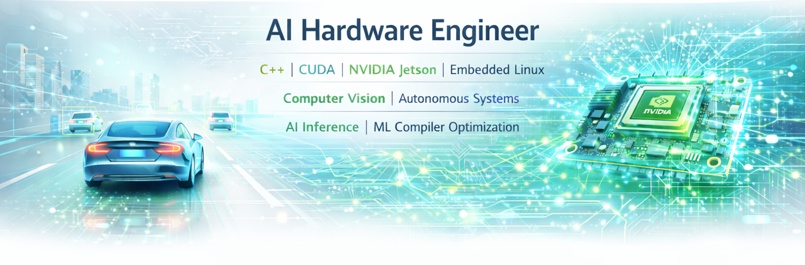
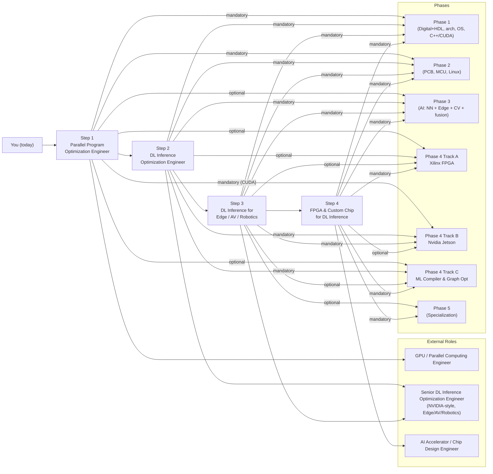

# AI Hardware Engineer Roadmap

**Want to become an NVIDIA GPU expert? Master Jetson edge deployment and Xilinx FPGAs? Ultimately design your own AI chip?** 

**You found the right place.**

This roadmap takes you from digital logic and C++/CUDA all the way to custom inference accelerators. You will write GPU kernels, deploy models on Jetson and FPGA, build embedded Linux BSPs, design custom carrier boards, and prototype AI silicon — all through real projects ([tinygrad](https://github.com/tinygrad/tinygrad), [openpilot](https://github.com/commaai/openpilot)).

**Who is this for?** EE/ECE students, software ML engineers, embedded engineers, and career changers targeting AI accelerators, edge AI, or autonomous systems. No prior ML course required — Phase 3 teaches what you need.

**Prerequisites:** Algebra/calculus · C or Python · Linux or WSL · FPGA board recommended for Phase 4 Track A (Xilinx)

**Estimated timeline:** ~2.5–5 years part-time (~10–15 hrs/week). Full-time learners move faster.

---

## Your Path: Four Career Steps

Each step is a **concrete role target** you can land as a job. The **5-phase curriculum** below builds the skills for each step. **Phase 4** splits into two parallel hardware tracks: **Track A — Xilinx FPGA** and **Track B — NVIDIA Jetson**.

| Step | You become | Also known as | What you can do | What you master |
|:----:|------------|---------------|-----------------|-----------------|
| **1** | **Parallel Program Optimization Engineer** | GPU / CUDA Engineer | Read kernel traces, find bottlenecks, optimize parallel programs on GPU/SoC | CUDA/OpenCL kernels, memory hierarchy, warp/SM behavior, tinygrad backends |
| **2** | **DL Inference Optimization Engineer** | TensorRT / Compiler Backend Engineer, AI Compiler Engineer | Take a model from graph to optimized deployment with measurable speedup | Model/operator optimization, TensorRT, tinygrad compiler (IR, scheduling, BEAM), quantization, MLIR/TVM |
| **3** | **DL Inference for Edge / AV / Robotics** | **Embedded Software Engineer**, **Embedded Linux Engineer** | Own inference on edge/AV/robotics; hit latency and power targets on real SoCs | Power/latency-constrained deployment, sensor→actuation pipeline, openpilot/Jetson/DRIVE; schematic/PCB; MCU/RTOS + Linux BSP |
| **4** | **FPGA & Custom Chip for DL Inference** | **FPGA Engineer** (RTL/HLS/prototyping) | Design FPGA accelerators for DL; understand the custom-chip path | Mapping inference to hardware, HLS/RTL, accelerator architecture (systolic, dataflow), ASIC path |

**Reference projects** used throughout all four steps:

| Project | Step 1 | Step 2 | Step 3 | Step 4 |
|---------|--------|--------|--------|--------|
| **[tinygrad](https://github.com/tinygrad/tinygrad)** | Trace ops→kernels, study backends | IR, scheduling, BEAM, quantization | On-device inference under edge constraints | Custom backend; workload for accelerator design |
| **[openpilot](https://github.com/commaai/openpilot)** | — | Why inference optimization matters in production | Full AV stack: camera→ISP→modeld→planning→CAN | Real workloads (vision, policy) for hardware design |

---

## 5-Phase Curriculum

### Phase 1: Digital Foundations (6–12 months)

> *The language of hardware — from gates and Verilog to CUDA kernels.*

| Topic | Key Skills | Why it matters for AI hardware |
|-------|------------|-------------------------------|
| [**Digital Design and HDL**](Phase%201%20-%20Foundational%20Knowledge/1.%20Digital%20Design%20and%20Hardware%20Description%20Languages/Guide.md) | Number systems, logic, memory; Verilog, testbenches, synthesis | From gates to RTL — the vocabulary of accelerator datapaths |
| [**Computer Architecture**](Phase%201%20-%20Foundational%20Knowledge/2.%20Computer%20Architecture%20and%20Hardware/Guide.md) | ISA through microarchitecture (pipelines, caches, OoO, coherence); modern CPUs/GPUs/memory/I/O | Same limits (bandwidth, latency, power) govern TinyML through data-center GPUs |
| [**Operating Systems**](Phase%201%20-%20Foundational%20Knowledge/3.%20Operating%20Systems/Guide.md) | Processes, threads, scheduling, memory management, synchronization, drivers | Underpins Linux, RTOS, and every deployment target |
| [**C++ and Parallel Computing**](Phase%201%20-%20Foundational%20Knowledge/4.%20C%2B%2B%20and%20Parallel%20Computing/Guide.md) | Four sub-tracks: **C++ & SIMD**, **OpenMP & OneTBB**, **CUDA & SIMT**, **OpenCL** | CPU vectors through GPU kernels — your first hands-on with parallelism |

**Build:** Calculator on breadboard, FPGA digital clock, traffic light controller, UART module, basic RISC-V core; SIMD/OpenMP exercises; CUDA vector/SAXPY/matmul + CPU goldens; optional OpenCL vector add

---

### Phase 2: Embedded Systems (6–12 months)

> *The boards and buses that sit next to inference — MCUs, RTOS, and embedded Linux.*

| Topic | Key Skills | Why it matters for AI hardware |
|-------|------------|-------------------------------|
| [**Embedded Software**](Phase%202%20-%20Embedded%20Systems/1.%20Embedded%20Software/Guide.md) | ARM Cortex-M, FreeRTOS, SPI/UART/I2C/CAN, power, OTA | Sensor buses and real-time tasks next to inference |
| [**Embedded Linux**](Phase%202%20-%20Embedded%20Systems/2.%20Embedded%20Linux/Guide.md) | Yocto, PetaLinux, kernel, rootfs | Jetson and edge products ship on embedded Linux |

**Build:** FreeRTOS sensor pipeline, DMA UART, SPI IMU, CAN network, MCUboot, Yocto image

---

### Phase 3: Artificial Intelligence (6–12 months)

> *The workloads your hardware must run — neural networks, edge deployment, vision, and sensor fusion.*
>
> *Hub:* [**Phase 3 — Artificial Intelligence**](Phase%203%20-%20Artificial%20Intelligence/Guide.md)

| Topic | Key Skills | Why it matters for AI hardware |
|-------|------------|-------------------------------|
| [**Neural Networks**](Phase%203%20-%20Artificial%20Intelligence/Neural%20Networks/Guide.md) | MLPs, CNNs, training, tinygrad, PyTorch; [pytorch-and-micrograd](Phase%203%20-%20Artificial%20Intelligence/Neural%20Networks/pytorch-and-micrograd/Guide.md) | What accelerators must implement — tensors, ops, autodiff |
| [**Edge AI**](Phase%203%20-%20Artificial%20Intelligence/Edge%20AI/Guide.md) | On-device tiers, latency/privacy, train → optimize → deploy | Context before Phase 4 Jetson / FPGA mapping |
| [**Computer Vision**](Phase%203%20-%20Artificial%20Intelligence/Computer%20Vision/Guide.md) | Image processing, detection, OpenCV | Perception stack before FPGA or Jetson deployment |
| [**Sensor Fusion**](Phase%203%20-%20Artificial%20Intelligence/Sensor%20Fusion/Guide.md) | Camera, LiDAR, IMU, Kalman, BEVFusion, MOT | Multi-sensor math before/alongside Jetson + ROS2 |

**Build:** micrograd, CNN from scratch, tinygrad tutorials, OpenCV / detection exercises, calibration / tracking labs (often on Jetson in Phase 4)

---

### Phase 4: Hardware Deployment & Compilation (6–12 months each track)

> *Where it all comes together — deploy AI on real silicon and learn how compilers bridge models to hardware.*

Pick **Track A (Xilinx FPGA)**, **Track B (NVIDIA Jetson)**, **Track C (ML Compiler)**, or combine them (typical for accelerator + edge roles). Track C complements both A and B — it teaches the compiler and graph optimization stack that feeds into any hardware target.

#### Track A — Xilinx FPGA

> *Prototype your own accelerator: Vivado, Zynq, HLS, and production FPGA design.*

| Topic | Key Skills | Why it matters for AI hardware |
|-------|------------|-------------------------------|
| [**Xilinx FPGA Development**](Phase%204%20-%20Track%20A%20-%20Xilinx%20FPGA/1.%20Xilinx%20FPGA%20Development/Guide.md) | Vivado, IP, timing, ILA/VIO | AI accelerator prototyping (FINN, Vitis AI) |
| [**Zynq UltraScale+ MPSoC**](Phase%204%20-%20Track%20A%20-%20Xilinx%20FPGA/2.%20Zynq%20UltraScale%2B%20MPSoC/Guide.md) | PS/PL, Linux on Zynq | CPU + accelerator SoC template |
| [**Advanced FPGA Design**](Phase%204%20-%20Track%20A%20-%20Xilinx%20FPGA/3.%20Advanced%20FPGA%20Design/Guide.md) | CDC, floorplanning, power, PR | Production FPGA AI |
| [**HLS**](Phase%204%20-%20Track%20A%20-%20Xilinx%20FPGA/4.%20High-Level%20Synthesis%20%28HLS%29/Guide.md) | C→RTL, dataflow, pipelining | Conv/matmul accelerators |
| [**Runtime & Driver Development**](Phase%204%20-%20Track%20A%20-%20Xilinx%20FPGA/5.%20Runtime%20and%20Driver%20Development/Guide.md) | XRT, DMA, Linux kernel drivers, user-space runtime, Vitis AI/FINN | Bridge your accelerator to software — the API that makes hardware usable |

**Build:** Matmul/conv accelerators, image pipeline, NN on FPGA, XRT host app, DMA benchmark, platform driver, C++/Python runtime library; *OpenCL (portable kernels) lives in [Phase 1 — C++ and Parallel Computing / OpenCL](Phase%201%20-%20Foundational%20Knowledge/4.%20C%2B%2B%20and%20Parallel%20Computing/OpenCL/Guide.md)*

#### Track B — NVIDIA Jetson

> *Master the Jetson edge platform end-to-end: from JetPack and custom carrier boards to secure OTA and production manufacturing.*

| Topic | Key Skills | Projects |
|-------|------------|----------|
| [**Nvidia Jetson Platform**](Phase%204%20-%20Track%20B%20-%20Nvidia%20Jetson/1.%20Nvidia%20Jetson%20Platform/Guide.md) | Orin Nano, JetPack, L4T, CUDA | Detection, deployment, robot |
| [**Custom carrier board**](Phase%204%20-%20Track%20B%20-%20Nvidia%20Jetson/2.%20Custom%20Carrier%20Board%20Design%20and%20Bring-Up/Guide.md) | P3768 reference, schematic, PCB, thermal, bring-up | Custom Orin Nano carrier project |
| [**L4T customization**](Phase%204%20-%20Track%20B%20-%20Nvidia%20Jetson/3.%20L4T%20Customization/Guide.md) | Rootfs, kernel/DT, OTA vs Yocto | Fleet images, BSP hardening |
| [**FSP / SPE firmware**](Phase%204%20-%20Track%20B%20-%20Nvidia%20Jetson/4.%20FSP%20%28Firmware%20Support%20Package%29%20Customization/Guide.md) | FreeRTOS on SPE/AON, peripherals, `spe-fw` flash | Wake, low-level I/O next to L4T |
| [**Application Development**](Phase%204%20-%20Track%20B%20-%20Nvidia%20Jetson/5.%20Application%20Development/Guide.md) | Peripherals, networking, GUI, multimedia, ML/AI, ROS 2 | Sensor dashboard, camera pipeline, inference, robot |
| [**Security and OTA**](Phase%204%20-%20Track%20B%20-%20Nvidia%20Jetson/6.%20Security%20and%20OTA/Guide.md) | Secure boot, OP-TEE, encryption, A/B OTA | Hardened OTA with rollback |
| [**Compliance and manufacturing**](Phase%204%20-%20Track%20B%20-%20Nvidia%20Jetson/7.%20Compliance%20and%20Manufacturing/Guide.md) | FCC/CE, DFM, production flash, supply chain | Production flash station, factory test |
| [**Runtime & Driver Development**](Phase%204%20-%20Track%20B%20-%20Nvidia%20Jetson/8.%20Runtime%20and%20Driver%20Development/Guide.md) | CUDA runtime/driver API, TensorRT engine execution, DLA runtime, nvgpu driver stack, DeepStream, Triton | Own the full inference runtime — from kernel launch to multi-engine scheduling |

#### Track C — ML Compiler & Graph Optimization

> *The bridge between AI models and hardware — learn how compilers lower neural-network graphs to efficient, hardware-specific code, then apply it to real inference.*

| Part | Key Skills | Why it matters for AI hardware |
|------|------------|-------------------------------|
| [**Part 1 — Compiler Fundamentals**](Phase%204%20-%20Track%20C%20-%20ML%20Compiler%20and%20Graph%20Optimization/Guide.md) | ONNX/IR, graph optimization passes, LLVM, MLIR dialects, TVM/tinygrad compiler, custom backends | The compiler decides how models become hardware instructions — fusing ops, tiling for memory, generating target code |
| [**Part 2 — DL Inference Optimization**](Phase%204%20-%20Track%20C%20-%20ML%20Compiler%20and%20Graph%20Optimization/DL%20Inference%20Optimization/Guide.md) | Profiling (Nsight), Triton/CUTLASS/Flash-Attention kernel engineering, quantization (PTQ/QAT), inference runtimes (TensorRT, Triton server), tinygrad deep dive | Apply compiler + kernel skills to production GPU inference — the hands-on complement to Part 1 |

**Part 1 modules:** Graph IR & representation · Graph optimization passes (fusion, layout, memory planning) · LLVM fundamentals (IR, passes, backend codegen) · MLIR (dialects, progressive lowering, custom NPU dialect) · ML-to-hardware pipelines (TVM, tinygrad BEAM, torch.compile, XLA, IREE) · Kernel fusion & tiling strategies · Custom backend development (TVM BYOC, tinygrad backend, MLIR lowering)

**Part 2 modules:** Graph & operator optimization + profiling · Kernel engineering (Triton, CUTLASS/CuTe, Flash-Attention, NCCL) · Compiler stack (IR, BEAM, codegen) · Quantization (PTQ, QAT, INT8/INT4) · Inference runtimes & deployment (TensorRT, ONNX Runtime, Triton server) · tinygrad deep dive (optional)

**Build:** ONNX graph analysis, Conv+BN+ReLU fusion pass, custom LLVM pass, MLIR Toy tutorial + NPU dialect, TVM AutoTVM tuning, tinygrad BEAM study, TVM BYOC backend, Triton fused kernel, Flash-Attention study, INT8 TensorRT engine, runtime benchmark report

---

### Phase 5: Specialization Tracks (ongoing)

> *Go deep in the direction that matches your career goal.*
>
> *Prerequisites:* **Phases 1–2**, **Phase 3** as needed for ML literacy, and the **Phase 4 Track A / Track B** modules noted per row.

| Track | Prerequisites | Focus | Guide |
|-------|--------------|-------|-------|
| **A: Autonomous Driving** | Phase 3 (**Computer Vision**, **Sensor Fusion**), Phase 4 Track B — Jetson (**Edge AI**) | openpilot, tinygrad on-device, ISP, BEV; includes [Lauterbach TRACE32](Phase%205%20-%20Advanced%20Topics%20and%20Specialization/4.%20Autonomous%20Driving/Lauterbach%20TRACE32%20Debug/Guide.md) for automotive ECU debug | [Guide →](Phase%205%20-%20Advanced%20Topics%20and%20Specialization/4.%20Autonomous%20Driving/Guide.md) |
| **B: AI Chip Design** | Phase 4 Track A — Xilinx (**HLS**, advanced FPGA), Phase 4 Track C — **ML Compiler**, Phase 3 [**Neural Networks**](Phase%203%20-%20Artificial%20Intelligence/Neural%20Networks/Guide.md) | Systolic arrays, dataflow, tinygrad↔hardware, ASIC path | [Guide →](Phase%205%20-%20Advanced%20Topics%20and%20Specialization/5.%20AI%20Chip%20Design/Guide.md) |
| **C: High Performance Computing** | Phase 4 Track B — Jetson (CUDA stack), Phase 4 Track C — **ML Compiler** (includes DL inference optimization) | **[Nvidia GPU](Phase%205%20-%20Advanced%20Topics%20and%20Specialization/1.%20High%20Performance%20Computing/Nvidia%20GPU/Guide.md):** NCCL, NVLink, IB, GPUDirect, clusters · **[AMD GPU](Phase%205%20-%20Advanced%20Topics%20and%20Specialization/1.%20High%20Performance%20Computing/AMD%20GPU/Guide.md):** ROCm, HIP, RCCL, MI300X | [Guide →](Phase%205%20-%20Advanced%20Topics%20and%20Specialization/1.%20High%20Performance%20Computing/Guide.md) |
| **D: Robotics** | Phase 3 (**Sensor Fusion**), Phase 4 Track B — Jetson (**ROS2**) | Nav2, MoveIt, planning | [Guide →](Phase%205%20-%20Advanced%20Topics%20and%20Specialization/3.%20Robotics%20Application/Guide.md) |
| **E: Edge Computing** | Phases 1–2, Phase 4 Track B — Jetson | Efficient nets, quantization, Holoscan, real-time streaming pipelines | [Guide →](Phase%205%20-%20Advanced%20Topics%20and%20Specialization/2.%20Edge%20Computing/Guide.md) |

---

## Career Paths

> *Where this roadmap can take you — mapped to real job titles.*

The **[four career steps](#your-path-four-career-steps)** above are the **progression**. The tables below map **job titles** to **curriculum depth**.

### By career step (1–4)

| Career step | Role titles (examples) | Phases you lean on most | Phase 5 specialization (if any) |
|:-----------:|------------------------|-------------------------|----------------------------------|
| **1** — Parallel Program Optimization | GPU / CUDA Engineer, Performance Engineer (GPU) | [1](Phase%201%20-%20Foundational%20Knowledge) (architecture + §4 C++/CUDA), [4B Jetson](Phase%204%20-%20Track%20B%20-%20Nvidia%20Jetson) | [C: HPC](Phase%205%20-%20Advanced%20Topics%20and%20Specialization/1.%20High%20Performance%20Computing/Guide.md) |
| **2** — DL Inference Optimization | TensorRT / ORT Engineer, AI Compiler Engineer, Compiler Backend (ML) | [1](Phase%201%20-%20Foundational%20Knowledge), [3 — NN](Phase%203%20-%20Artificial%20Intelligence/Neural%20Networks/Guide.md), [Edge](Phase%203%20-%20Artificial%20Intelligence/Edge%20AI/Guide.md), [4B Jetson](Phase%204%20-%20Track%20B%20-%20Nvidia%20Jetson), [4C Compiler](Phase%204%20-%20Track%20C%20-%20ML%20Compiler%20and%20Graph%20Optimization/Guide.md) | [C: HPC](Phase%205%20-%20Advanced%20Topics%20and%20Specialization/1.%20High%20Performance%20Computing/Guide.md) |
| **3** — Edge / AV / Robotics | Edge ML, Jetson, perception, robotics; **Embedded SW**, **Embedded Linux** | [1](Phase%201%20-%20Foundational%20Knowledge)–[2](Phase%202%20-%20Embedded%20Systems), [3](Phase%203%20-%20Artificial%20Intelligence/Guide.md), [4B Jetson](Phase%204%20-%20Track%20B%20-%20Nvidia%20Jetson) | [A](Phase%205%20-%20Advanced%20Topics%20and%20Specialization/4.%20Autonomous%20Driving/Guide.md), [D](Phase%205%20-%20Advanced%20Topics%20and%20Specialization/3.%20Robotics%20Application/Guide.md), [E](Phase%205%20-%20Advanced%20Topics%20and%20Specialization/2.%20Edge%20Computing/Guide.md) |
| **4** — FPGA & custom silicon | FPGA / RTL / AI Silicon; **FPGA Engineer** | [1](Phase%201%20-%20Foundational%20Knowledge)–[4A Xilinx](Phase%204%20-%20Track%20A%20-%20Xilinx%20FPGA), [4C Compiler](Phase%204%20-%20Track%20C%20-%20ML%20Compiler%20and%20Graph%20Optimization/Guide.md), optional [4B Jetson](Phase%204%20-%20Track%20B%20-%20Nvidia%20Jetson) | [B: AI Chip Design](Phase%205%20-%20Advanced%20Topics%20and%20Specialization/5.%20AI%20Chip%20Design/Guide.md) |

### By phase depth

| Phase | Typical roles | Notes |
|:-----:|---------------|-------|
| **[1](Phase%201%20-%20Foundational%20Knowledge)** | Software engineer with hardware literacy | Digital + HDL, architecture, OS, C++/CUDA — no dedicated NN course here |
| **[2](Phase%202%20-%20Embedded%20Systems)** | PCB / schematic, MCU / RTOS, Embedded Linux / Yocto | Feeds Jetson and custom carrier work |
| **[3](Phase%203%20-%20Artificial%20Intelligence/Guide.md)** | ML engineer (graphs, CV, fusion) | Neural networks, edge context, OpenCV, sensor fusion before hardware mapping |
| **[4A Xilinx](Phase%204%20-%20Track%20A%20-%20Xilinx%20FPGA)** | FPGA / RTL / HLS engineer, FPGA Runtime Engineer | **FPGA Engineer** + runtime & driver |
| **[4B Jetson](Phase%204%20-%20Track%20B%20-%20Nvidia%20Jetson)** | Jetson, TensorRT, ROS2, embedded titles, GPU Runtime Engineer | **Embedded Software / Linux** + inference runtime |
| **[4C Compiler](Phase%204%20-%20Track%20C%20-%20ML%20Compiler%20and%20Graph%20Optimization/Guide.md)** | AI Compiler Engineer, DL Graph Optimization Engineer | LLVM, MLIR, TVM, tinygrad compiler, custom backends |
| **[5](Phase%205%20-%20Advanced%20Topics%20and%20Specialization)** | ADAS, HPC infra (Nvidia + AMD), robotics, edge computing, accelerator architect | Tracks A–E above |

### Quick lookup: role → phases

| Role | Primary phases | Typical career step | Phase 5 |
|------|---------------|---------------------|---------|
| Parallel Program Optimization Engineer | [1](Phase%201%20-%20Foundational%20Knowledge), [4B Jetson](Phase%204%20-%20Track%20B%20-%20Nvidia%20Jetson) | 1 | [C](Phase%205%20-%20Advanced%20Topics%20and%20Specialization/1.%20High%20Performance%20Computing/Guide.md) |
| AI Compiler Engineer | [1](Phase%201%20-%20Foundational%20Knowledge), [3 — NN](Phase%203%20-%20Artificial%20Intelligence/Neural%20Networks/Guide.md), [4C Compiler](Phase%204%20-%20Track%20C%20-%20ML%20Compiler%20and%20Graph%20Optimization/Guide.md) | 2 | [C](Phase%205%20-%20Advanced%20Topics%20and%20Specialization/1.%20High%20Performance%20Computing/Guide.md) |
| DL Inference Optimization Engineer | [1](Phase%201%20-%20Foundational%20Knowledge), [3 — NN](Phase%203%20-%20Artificial%20Intelligence/Neural%20Networks/Guide.md), [Edge](Phase%203%20-%20Artificial%20Intelligence/Edge%20AI/Guide.md), [4B Jetson](Phase%204%20-%20Track%20B%20-%20Nvidia%20Jetson), [4C Compiler](Phase%204%20-%20Track%20C%20-%20ML%20Compiler%20and%20Graph%20Optimization/Guide.md) | 2 | [C](Phase%205%20-%20Advanced%20Topics%20and%20Specialization/1.%20High%20Performance%20Computing/Guide.md) |
| GPU / Accelerator Runtime Engineer | [1](Phase%201%20-%20Foundational%20Knowledge), [4B Jetson §8](Phase%204%20-%20Track%20B%20-%20Nvidia%20Jetson/8.%20Runtime%20and%20Driver%20Development/Guide.md) or [4A Xilinx §5](Phase%204%20-%20Track%20A%20-%20Xilinx%20FPGA/5.%20Runtime%20and%20Driver%20Development/Guide.md) | 2–3 | [C](Phase%205%20-%20Advanced%20Topics%20and%20Specialization/1.%20High%20Performance%20Computing/Guide.md) |
| Edge ML / Jetson deployment | [1](Phase%201%20-%20Foundational%20Knowledge)–[2](Phase%202%20-%20Embedded%20Systems), [3](Phase%203%20-%20Artificial%20Intelligence/Guide.md), [4B Jetson](Phase%204%20-%20Track%20B%20-%20Nvidia%20Jetson) | 3 | [E](Phase%205%20-%20Advanced%20Topics%20and%20Specialization/2.%20Edge%20Computing/Guide.md) |
| **Embedded Software Engineer** | [1](Phase%201%20-%20Foundational%20Knowledge), [2](Phase%202%20-%20Embedded%20Systems) | Supports step 3 | — |
| **Embedded Linux Engineer** | [1](Phase%201%20-%20Foundational%20Knowledge), [2](Phase%202%20-%20Embedded%20Systems) | Supports step 3 | — |
| **FPGA Engineer** | [1](Phase%201%20-%20Foundational%20Knowledge), [4A Xilinx](Phase%204%20-%20Track%20A%20-%20Xilinx%20FPGA) | 4 | [B](Phase%205%20-%20Advanced%20Topics%20and%20Specialization/5.%20AI%20Chip%20Design/Guide.md) |
| Perception / Sensor Fusion | [3 CV](Phase%203%20-%20Artificial%20Intelligence/Computer%20Vision/Guide.md), [3 fusion](Phase%203%20-%20Artificial%20Intelligence/Sensor%20Fusion/Guide.md), [4B Jetson](Phase%204%20-%20Track%20B%20-%20Nvidia%20Jetson) | 3 | [A](Phase%205%20-%20Advanced%20Topics%20and%20Specialization/4.%20Autonomous%20Driving/Guide.md) or [D](Phase%205%20-%20Advanced%20Topics%20and%20Specialization/3.%20Robotics%20Application/Guide.md) |
| ADAS / Autonomous Driving | [1](Phase%201%20-%20Foundational%20Knowledge)–[2](Phase%202%20-%20Embedded%20Systems), [4B Jetson](Phase%204%20-%20Track%20B%20-%20Nvidia%20Jetson) | 3 | [A](Phase%205%20-%20Advanced%20Topics%20and%20Specialization/4.%20Autonomous%20Driving/Guide.md) |
| GPU / HPC / ML Infra | [1](Phase%201%20-%20Foundational%20Knowledge), [4B Jetson](Phase%204%20-%20Track%20B%20-%20Nvidia%20Jetson) | 1–2 | [C](Phase%205%20-%20Advanced%20Topics%20and%20Specialization/1.%20High%20Performance%20Computing/Guide.md) |

---

**Built for the AI hardware community** · [Star ⭐](https://github.com/ai-hpc/ai-hardware-engineer-roadmap) if you find this useful

